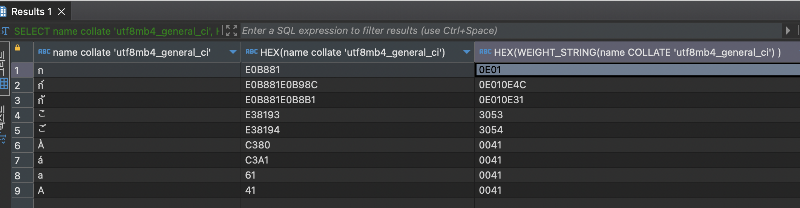

어떤 버그 제보는 나를 깊은 기술의 심연으로 떨어뜨린다. 
11월의 어느 날 들어온 이슈도 그랬다. 

> '저. . .  ก 에서 ก์ 로  값을 업데이트를 했는데요 . . . 몇번을 해봐도 그대로고 업데이트가 안돼요 🤔'

아차차! 내가 최근에 잘못된 커밋을 내보냈나? 팀원이 했던 패치에서 검토를 놓쳐서 잘못 나갔나? 난 정말 멍충이야,, 따위의 자책을 바로 시작하면서 하면서 '확인해보겠습니다.' 를 입력했다. 그리고는 최근 변경을 검토했다. 

'이상하다, 최근에 해당 부분에 나간 변경점은 없는데.'

이렇게 되면 할 일은 개발환경에서 재현해보기다. 리얼환경에서는 시도하는 순간 서비스에 반영이 되어버리므로, 리얼환경에서는 할 수 없다.  그런데 이상하게도 개발환경에서는 해당 건이 재현되지 않는다.  ก 에서 ก์  로 업데이트 하든,  ก์  에서 ก 으로 업데이트하든 정상적으로 잘 된다. 

슬슬 제보자의 환경이슈를 의심해볼 무렵에는 마음을 가라앉히고 다시 로직을 봐야한다. '**같지 않으면 값을 업데이트한다**' 는 로직. 다시봐도 정상적으로 동작하는 로직이다. 무엇보다 개발환경에서는 발생하지 않고 있는데. 하며 머리를 싸맬 무렵, 슬랙에서도 비슷하게 파악한 팀 동료의 메시지 알림이 울렸다. 이거, 실제로 **문자열을 동일하게 보지 않는 이상** 잘 업데이트 되야하는 구조 같다고. 

말도 안돼. 눈으로 다른데 어떻게 동일해, 하면서 반신반의하면서 select 를 한다. 
```sql 
select * from table where message = 'ก';
-- 1, ก

select * from table where message = 'ก์';
-- 1, ก
```

아, [글자 수 세기의 딜레마](https://juneyr.dev/counting-character) 의 교훈이 있었음에도 또 속았다. 
'설마 이렇게 눈으로 보이는게 다른데 같은 문자열로 인식하겠어?' 라고 생각했던 게 패착이었다.

## 나한테 왜 그랬어요 

mysql 8.0 의 환경에서 바로 값을 쳐봤다. 

```sql
SELECT 'ก' = 'ก์';
-- 1 , 즉 같은게 맞다 
```

mysql 8.0 은 나의 믿음을 배신하고 두 문자가 같다고 말해주었다. 왜 그랬을까? 사실 이건 mysql 8.0 의 문제이기도, 아니기도 하다. 

바로 mysql 5.5/6/7 -> mysql 8.0 으로 옮기면서 기본 collation 이 **'utfmb4_0900_ai_ci'** 로 변경되었기 때문이다. 


이게 뭔데.. 라고 말하기 전에 잠깐 알아보자. 

**character set**은 '문자를 어떻게 인코딩해서 보여줄 것인가' 에 관한 이야기라고 보면된다. 해서 지금 알아본 database 의 기본 character set (charset) 은 **utf8mb4** 다. utf8, 은 unicode 의 가장 작은 인코딩을 8bit (1byte)으로 할 것이라는 이야기고 mb4 는 유니코드의 기본 범위(평면)을 넘어서는 경우 최대 한 문자를 4byte 로 처리한다는 뜻이다. (반면 mb3의 경우 기본 범위/평면을 넘어서는 경우 아예 저장하지 않게된다. ) 

기본 범위를 넘어서는 대표적인 문자는 이모지가 있는데, [U+1F600](https://unicode.org/emoji/charts-12.0/full-emoji-list.html#1f600), 즉 😀 를 예로 들 수 있다. (U+0000-U+10000 이상의 범위). 때문에 이모지가 저장안돼요~ 라고 하면 `utf8mb4` 로 charset이 되어있는지 확인하라고, 변경하라고 하는 것이다. 

그럼 collation 은? 
collation은 해당 character_set (charset) 에서 문자열을 '비교' 할 때 어떤 전략을 사용할까에 관한 이야기다. 외계어처럼만 보이는  `utf8mb4_0900_ai_ci`  에서 `utf8mb4` 는 charset 을 의미하고, 0900는 유니코드 9.0 버전 지원을 의미한다. (그렇다, 유니코드도 버전이 있고 거의 매년 업데이트된다.) 
`ai`는 accent-insensitive, 즉 비교를 할 때 **악센트에 해당하는 문자를 구분하지 않겠다**. 를 의미한다. 
`ci` 는 case-insensitive, 즉 비교를 할 때 **대소문자를 구분하지않겠다**. 를 의미하고 있고.

만약 구분을 하고 싶다면? 8.0 이후의 collation은 
- `as` : accent-sensitive 로 악센트 구분을 의미 
- `cs` : case-sensitive 로 대소문자 구분을 의미 

라는 약어로 구분을 하는 지 아닌지를 나타내게 된다. 

그럼 다시 돌아와서, mysql 8의 기본 collation 인 `utf8mb4_0900_ai_ci` 는 
- utf8mb4 의 charset에서 
- 유니코드 9.0을 지원하고 
- 악센트 구분을 하지 않고 
- 대소문자도 구분하지 않겠어. 

라는 의미라는 것을 의미한다. 


## 미궁에 빠지다 

아, 그러고 보니 ก์  위에 있는 ์  <- 이 문자.. 위에 있는거 보니 베이스가 되는 문자가 아니라,  accent 같다. 아~ accent 니까 `ai` 즉 accent-insensitive 인 경우 무시된 거구나. 

실제로 아래와 같이, 5.7에서 흔하게 사용하던 collation 을 사용하니까 바로 구분이 되는 것을 발견할 수 있다. 

```sql 
select 'ก' = 'ก์' COLLATE 'utf8mb4_general_ci';
-- 0, 즉 서로 다르다. 
```

그리고 8.0에서 새롭게 들어온 collation 이어도 `utf8mb4_0900_as_ci` 와 같이 accent 가 구분된다면 잘 구분된다. 

```sql
select 'ก' = 'ก์' COLLATE 'utf8mb4_0900_as_ci';
-- 0, 즉 서로 다르다. 
```

그렇다면 쓰던 collation이나 새로운 대체재 collation 이나 상관없겠군! 😎
이대로 수사를 종결하려고 확신을 가지고 몇가지를 더 테스트해보던 중, 의문스러운 결과를 몇가지 발견했다. 


첫번째는 아래 예시다. 

```sql
select 'a' = 'à' COLLATE 'utf8mb4_general_ci';
-- 1, 즉 서로 같다.
```

만약 `utf8mb4_general_ci` 가  accent 를 구분해주는 collation 이라면 위 내용은 어떻게 설명할 수 있나?  라틴어 악센트는 왜 구분이 안되는거야? 🤔


두번째는 아래 예시다. 

```sql 
select 'ก' = 'กั' COLLATE 'utf8mb4_0900_ai_ci';
-- 0, 서로 다르다
```

기존에 문제가 되었던 collation 을 그대로 두고, 위에 붙은 문자를 교체했다. 그런데 똑같이 위에 위치한 문자인데, 이번에는 문제가 되었던 collation 에서 문제가 되지 않는다.  ั 는 왜 구분이 잘 될까? 


### 첫번째 문제 : 'utf8mb4_general_ci' 는 왜 태국어에 accent-sensitive 한가 

이 부분은 [mysql 블로그](https://dev.mysql.com/blog-archive/sushi-beer-an-introduction-of-utf8-support-in-mysql-8-0/) 에서 그 힌트를 얻을 수 있다. 

mysql 블로그는 기존 utf8mb4 에서 가장 많이 채택된 utf8mb4_general_ci collation 에서, utf8mb4_0900_ai_ci 로 옮긴 이유를 말하면서 그 이유 중 하나를 'sorting level' , 즉 정렬의 정도를 꼽는다. 

블로그에 따르면 정렬의 정도란 다음 세 가지를 말한다.
- Primary Level 은 베이스가 되는 문자 사이의 구분을 의미한다.( “a” < “b” 즉, a와 b가 다르고 b가 후순위가 된다.)  
- Secondary Level은 악센트 구분을 의미한다. ( “as” < “às” < “at” 는 서로 다르고 우선순위가 있다.)
- Tertiary Level 은 대소문자 구분을 의미한다. ( “ao” < “Ao”< “aò”)

그러면서 다음과 같은 말을 적어둔다.
> MySQL 5.7 and earlier versions only supports sorting/comparison at the Primary level.

mysql 5.7 과 그 이전 버전은 primary level 수준의 정렬과 비교만을 지원했노라고. 

따라서 5.7 에서 'utf8mb4' 의 기본 collation으로 사용된 `utf8mb4_general_ci` 역시 베이스가 되는 문자 사이의 구분만 가능했다는 말이 된다. 

그러니 악센트와 대소문자 구분을 안했다는 것이지. 그럼 라틴어베이스의 악센트 구분이 안되는게 정상, 타이 문자의 악센트를 구분하는게 이상하다는 말이 된다. 

`UCA(Unicode Collation Algorithm)` 을 소개하는 [글](https://dev.mysql.com/doc/refman/8.0/en/charset-collation-implementations.html) 에서도 `utf8mb4_general_ci` 는 대표적으로 UCA 을 따르지 않는 collation 이라고 얘기하면서, 이런 collation은 case-insensitive and accent-insensitive 하다고 이야기한다. 


하지만 태국어와 일본어 케이스를 통해서, 나는 개인적으로 `utf8mb4_general_ci` 의 이런 악센트-insensitive 라는 말이 **부정확하다**! 라고 결론 내렸다.

그 기준을 찾기 위해 애썼지만 일관적인 기준을 찾을 수는 없었고, 아래 비교를 통해서 매번 확인해야한다고 생각한다. 

실제로 해당 collation 이 같은지 처리하는 기준인 weight_string의 HEX 값을 보자.

```sql 
SELECT name collate 'utf8mb4_general_ci', HEX(name collate 'utf8mb4_general_ci'),

HEX(WEIGHT_STRING(name COLLATE 'utf8mb4_general_ci') ) FROM <기준테이블>;
```

- 해당 테이블에는 태국어/thai 문자와 일본어, `acute`가 들어간 a 를 모두 넣어두었다.



-  `acute`  가 들어간 문자들은 전부 같은 값 `0041` 로 계산된다. 
- 태국어의 경우 모든 HEX(WEIGHT_STRING) 이 다르게 표현된다. 
- 일본어의 경우, ゛ 가 'Katakana-Hiragana Voiced Sound Mark' 라고 표현되며 'Modifier_Symbol' 라는, `acute` 와 같은 카테고리의 유니코드임에도 불구하고 3053와 3054로 다르게 표현된다.

그러므로 `utf8mb4_general_ci` 는 일부 accent에 대해서만 insensitive 가 보장되는 collation 인 것이다. 특정 언어에 대해서는 악센트인 것이 무시되므로, 다국어 환경의 서비스를 제공할 때는 이를 반드시 유의해야한다. 이러한 특성 때문에, utf8mb4_general_ci 는 오히려 한국어/일본어/중국어 제공시에는 선호되기도 한다. (글자를 모두 잘 구분해줌)

### 두번째 문제 : 'utf8mb4_0900_ai_ci' 는 왜 다른 accent(로 보이는 것)은 구분을 할까 

이 문제는 비교적 간단하다. 'ก' = 'กั' 라는 예시에서, ั 는 accent 가 아닌 [모음으로 기능](https://symbl.cc/kr/0E31/) 한다.
이는 모음도 위아래로 결합되는 태국어의 결합특성 때문이다. 애초에 태국어 유니코드 구분을 보면, 모음 단락이 따로 있어서 그렇다. 

한국어로 치면 ㄱ 와 가 를 비교하고 있는 느낌일까. 이는 accent 가 아니므로 `ai` 에서도 무시하지 않고 그대로 살려서 값을 보여준다. 


이 부분은 오히려 언어학적인 접근이 필요했던 것 같다. 

## 결론 

이 문제의 종결은 `utf8mb4_general_ci` 의 부족한 면과 영원히 모를 기준때문에라도, `utf8mb4_0900_as_ci` 로 넘어가는 것으로 결론이 났다.

추가적으로 mysql 8.0 에서 지적한 해당 collation 의 부족함은 다음과 같은데, 
- 해당 collation 은 SMP (supplementary multi-lingual plane) 에 있는 값의 비교를 지원하지 않는다. 해당 collation 에서의 🦦 과 🍤 는 같다! 
- 해당 collation (을 비롯한 5.7 이전의 collation)은 베이스 문자만 비교하는 수준의 정렬 수준을 지원한다. 8.0 에서는 accent 와 case 를 구분하는 수준 높은 정렬을 지원한다. 

이를 굳이 감수할 필요가 없었다. 

그리고 위에서 서술한 것 처럼, 
accent-insensitive 라고 느껴져도 일부 '악센트 문자' 로 생각되는 것들은 sensitive 한 경우가 있어 기준이 모호했다. 

따라서, 
만약 당신이 글로벌 언어를 제공하며, mysql 8.0 을 쓰면서, 다국어의 `ai` 구분 때문에 다시 collation 을 `utf8mb4_general_ci`로  넘어가려고 한다면,  원하는 바를 명확히하고 넘어가기를 권장한다. 

#### 참고 

- https://dev.mysql.com/doc/refman/8.0/en/charset-unicode-utf8mb4.html

- https://dev.mysql.com/blog-archive/mysql-8-0-collations-migrating-from-older-collations/

- https://dev.mysql.com/blog-archive/sushi-beer-an-introduction-of-utf8-support-in-mysql-8-0/


- https://dev.mysql.com/doc/refman/8.0/en/charset-collation-implementations.html


- https://www.compart.com/en/unicode/category/Sk#UNC_CAT