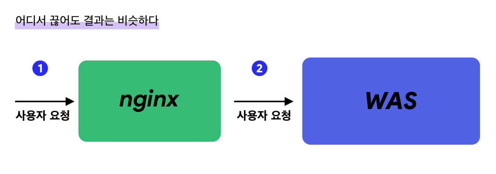
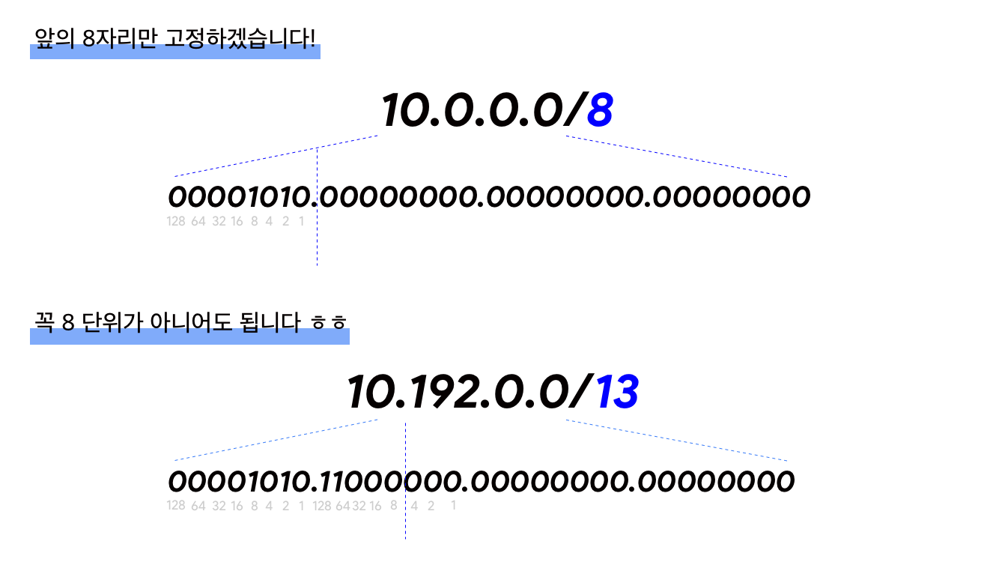

## 서론 

6월에 있었던 릴리즈를 회고하다보니, 아이러니하게도 코드적으로 생각나는 것보다는 처음으로 `점검모드`를 구현했던 것에 대한 감동이 컸다.
수많은 점검 공지를 보기만 했지, 직접 구현하는 입장이 될 줄이야! 🤷‍♀️

> 사용자의 요청을 일정 시간동안 막는다.

이 기능을 구현하기 위해서 어떻게 해야할까? 
다양한 방법이 있겠지만, 최소한 `코드를 매번 수정해서 배포하는 방식` 은 피하고싶다. 

그 이유는, 모듈이 크면 클 수록, 배포하는 시간이 길면 길수록 불리한 방식이기때문이다. 
점검을 2시에 한다고 했는데 배포때문에 2시 30분에 된다면.. 믿을 만한 시스템이 아니잖아!
점검 기능 자체가 모듈의 크기에 영향을 받는다면 독립성이 보장이 안되는 점이 마음에 걸린다.

그럼 어떤 방식을 채택할 수 있을까?




위 시스템을 보자.

nginx 가 WAS 의 리버스 프록시역할을 하고, 앞에서 요청을 1차적으로 받아주고 있는 형태의 흔한 구조다. 
이때 `1번 위치` 에서 요청을 제어하든, `2번 위치`에서 요청을 제어하든 일단 WAS 로만 요청이 안들어오면
서버의 로직이 작동하는 부분이 없으니, 이 관점에서는 큰 차이가 없다. 


`1번 위치` 에서 제어하면 이렇게 하면 될 것 같다.

- 특정 uri 에 대한 요청을 막는 로직을 활용해서, 모든 ip에 대해서 요청을 막는다. 
  -  이 서버가 죽었는지 알아보는 health check 나, status check 등에 대한 uri 는 반드시 프로덕션 환경에서는 누군가 확인할 수 없도록 막아줘야한다. 보통 `location` 블록을 사용해서 이런 부분을 제어하고 !

- 이 `요청을 막는 설정` 과 `기본 설정` 을 코드 한 줄로 바꿀 수 있으면 좋을 것 같다. 
  - 서버에 nginx conf 배포만 간단하게 할 수 없을까?


반면, `2번 위치`에서 제어하면 이렇게 하면 될 것 같다. 

- spring 의 경우, interceptor 에서 요청을 거부하면 될 것 같다. 
  - 단, 현재 점검인지 아닌지 판단하는 값을 외부에 저장해서, 이 부분만 변경하게 하면 될 것 같다. 
  - 그 값의 저장소는 RDB / Redis / 외부에서 연동해서 받아오는 설정파일 이든 상관없을 것 같다. 
    - 중요한 것은 이 값을 바꾸기 위해서 spring 프로그램을 다시 말지만 않으면 됨! 


오늘 얘기해볼 것은 `1번 위치`에서 제어하기, 즉 nginx 에서 제어하는 방법이다.


## nginx 의 IP 필터링
<sub> nginx 기초는 여기로! </sub>

[나는 nginx 설정이 정말 싫다구요](https://juneyr.dev/nginx-basics) 

nginx 설정 상의 `deny all;` 을 한번쯤은 봤을 지 모르겠다.
이는 허용된 것을 제외하고, 나머지 IP 대역대의 요청을(정확히는, nginx 의 remote address 기준) 를 모두 거부하는 명령어다. 
이 명령어를 입력하는 경우 proxy 혹은 원하는 동작대로 떨어지지 않고, error 케이스로 표현된다.

방금 전에 `허용 된 것을 제외하고,` 라고 이야기했는데, 일부 허용은 어떻게할까? 
예를 들어 `점검 상태에서 사내망만 허용하는 경우.` 
이럴때는 `allow 10.0.0.0/8` 과 같은 형식을 추가해서 일부만 허용해준다. 

```bash
allow 10.0.0.0/8;
deny all;

```
위와 같은 경우 10.0.0.0/8 범위에 해당하는 IP는 들어오고, 나머지는 들어오지 않게 된다. 
allow 하는 목록이 위로 가야한다는 점에 유의하자.
`deny all;` 이하에 allow 리스트가 있다면 원하는 대로 동작하지않게 된다. 

그런데 저 `10.0.0.0/8` 이라는 표기는 뭐지?

### CIDR (Classless Inter-Domain Routing)
  
CIDR 는 IP 사용법이자 표기법으로, 부족한 IPv4 를 잘 쓸 수 있게 해주는 방법이다. 
IPv4 와 자릿수를 고정해서 쓴다. 예를 들어 10.0.0.0/8 이라면 10은 고정이고 이후의 0.0.0 을 변동해서 쓸 수 있는 범위라는 뜻이다. 어 뭐야 두자리수인데 왜 8이라고해요? 라고 하면 IPv4는 32bit (32칸이라고 생각하면 편함) 이고 이를 8bit 씩 나누고 있다. 
그 경계를 `.` 로 표시하고!



즉 10은 십진법으로 나타낸 10이지만, 8bit 자리에 맞게 하면 00001010 이고, /8은 8bit만큼은 고정이라는 이야기니까. 그래서 많은 경우 /8, /16, /24, /32 해주면 정말정말 편하지만 아닌 경우도 왕왕 있다. 
언젠가 IPv4의 갯수 부족으로 IPv6로 완전히 교체될거라고 생각했는데 이 CIDR, 그리고 서브넷 개념을 도입하면서 그렇지 않게 되었다.
cidr를 더 자세히 알려면 서브넷 개념과 VPC 를 같이보면 좋겠지만, 여기서는 이 정도로 충분하다.

  
## 일반 상태와 점검 상태 

다시 돌아와서, 그러면 일반적인 상태와 점검 상태를 어떻게 정리하면 좋을까? 

일반 상태의 conf 가 다음과 같다고 하자. 

```bash

upstream was_app {
    server localhost:8080;

    keepalive 100;
  }

# 중략 
server {
  # (...)
location / {
      include proxy.conf;
      proxy_pass http://was_app;
    }
  # (...)
}

```
일반적으로, `/` uri 에 들어온 값은 `was_app` upstream 으로 설정된 곳으로 프록시하는 설정이다. 
spring boot를 8080 포트에 띄웠다고 하면 해당 어플리케이션으로 값을 처리하도록 되는 상황이고! 

그러면 동일한 조건에서 점검 모드의 설정을 보자.

```bash:title=maintenance-nginx.conf

upstream was_app {
    server localhost:8080;

    keepalive 100;
  }

# 중략 
server {
  # (...)
location / {
      deny all;
      include proxy.conf;
      proxy_pass http://was_app;
      error_page 403 =503 /maintenance.json;
    }
  # (...)
}

```
`deny all;` 을 넣고, 동일하게 proxy_pass 를 넣었다. 
allow 가 추가되지 않는 이상, 여기에서 실제로 **proxy가 될 일은 없다.** 
대신, error_page 403을 반환하고, 이때 강제로 `503`으로 status를 내리며, 결과 응답은 maintenance.json 경로로 보낸다.
(이 error_page는 단순히 403만 반환하도록 해도 상관없다!)

이렇게 두 벌의 conf를 준비했으면 
- 일반모드
- 전체ip에 대한 점검모드 
를 준비한 셈이다. 

그런데 `특정 ip에 대해서는 일반모드, 나머지는 점검모드`라는 목적까지 달성하려면? 
위에서 말한것처럼 allow 를 추가해주어야한다. 
```bash:title=maintenance-ip-nginx.conf

upstream was_app {
    server localhost:8080;

    keepalive 100;
  }

# 중략 
server {
  # (...)
location / {
      allow <원하는 ip대역>;
      deny all;
      include proxy.conf;
      proxy_pass http://was_app;
      error_page 403 =503 /maintenance.json;
    }
  # (...)
}

```
그런데 대역이 많아지면 어떡할까? 
계속 `deny all;` 위에 넣는 방법도 있겠지만, 새로 conf로 빼는 것이 좋아보인다. 

```bash:title=allow-list.conf
# last updated at: 2021-09-18 22:06:44 +0900

# 어딘가의 office
allow 10.0.0.1;

# 어딘가의 office 2
allow 10.0.10.0/8;

# (중략)
deny all;
```
그리고 이 설정 파일을 include한다. 
```bash:title=nginx.conf

upstream was_app {
    server localhost:8080;

    keepalive 100;
  }

# 중략 
server {
  # (...)
location / {
      include allow-list.conf;
      include proxy.conf;
      proxy_pass http://was_app;
      error_page 403 =503 /maintenance.json;
    }
  # (...)
}
```
이렇게 하면 총 세벌의 conf가 생긴다. 

- 일반 모드 conf
- 전체 점검 모드 conf
- 일부 ip 에 대해서는 일반, 나머지에 대해서는 점검 모드 conf

점검을 걸때는 이 conf를 바꿔치기 해주기만 하면 된다. 
그러면 이걸 저장해뒀다가 직접 복사해줘야 할까? =)... 😇
이 부분에서는 `ansible`을 활용할 수 있다.

## 이 과정을 ansible 로 만들자.

### ansible 간단 맛보기 

ansible 은 배포/유지 보수를 쉽게 만들어주는 IT 자동화 툴의 일종이다. 
위 예를 들어보자.
서버가 10대라면,10대 서버의 각각 nginx의 설정을 모두 바꿔줘야 
어느 서버에 붙은 유저든 상관없이 점검모드를 볼 수 있을 것이다. 

10대를 손으로 하는데 오류가 발생하지않을 수 있을까? 
또, 10대가 아니라 20대, 100대라면? 

이런 경우 ansible 을 사용해서 각 서버에 같은 설정을 배포하거나, 설치하는데 도움을 얻을 수 있다.


ansible에 대한 정보는 [ansible github](https://github.com/ansible/ansible)에서 추가로 얻을 수 있다. 
여기서는 필요한 만큼 간략히 말해보자면, ansible 의 코어는 

> 특정한 서버(inventory)에 수행할 작업들(task/play) 를 나열한 각본(playbook)을 실행하는 것
이다. 

예를 들어, ansible 을 사용한 코드를 한 줄 보자. 

```bash 
ansible-playbook playbooks/maintenance-on.yml -i hosts/api 
```
이 코드는 ansible playbook을 실행하는데, 
그 playbook은 `playbooks/maintenance-on.yml` 이라는 playbook이고 
해당하는 서버는 (`-i`) `hosts/api` 하위에 정의된 서버이다. 

ansible을 설치해둔 서버에서 해당 코드를 실행하면, 
ansible agent 에서 ssh 로 각 서버에 접속해 playbook에 있는 task를 실행하게 된다. 

### 실제 점검을 ansible로 만들자

위 예제에서 이어가보자. 그럼 playbook의 내용은 어떻게 되어야할까?

```bash:title=maintenance-on.yml 
---
- name: maintenance on
  serial: "{{ serial|default(1) }}"

  roles:
    - { role: "infra/nginx", command: "maintenance_on" }
    - { role: "infra/nginx", command: "restart" }
```
이 각본(playbook)을 실행하면 차례로 maintenance_on, restart 라는 task가 실행된다. 
이 task 는 위에서 정의한 `hosts/api` 하위의 서버에 적용되고, 
serial 설정에 따라 순차적으로 적용될지, 여러개가 함께 적용될지 정할 수 있다. 


그러면 첫번째로 적용되는 `maintenance_on` task는 어떻게 될까?
```bash:title=roles/infra/nginx/tasks/maintenance_on.yml
---
### deploy maintenance conf

- name: maintenance conf (deny all)
  template:
    src: maintenance-nginx.conf
    dest: "{{ nginx_conf_path }}/nginx.conf"
    mode: 0600
```

이게 실제로 nginx 의 설정을 **바꿔치기해주는** 부분이다. 
이 task 내부 과정의 이름은 maintenance conf (deny all) 인 것이고, 
dest에 src 를 복사해준다. 이때 권한은 [0600](https://chmodcommand.com/chmod-0600/) (owner만 읽기/쓰기할 수 있고 실행은 못하는 상태) 로 준다.

두번째 restart는, nginx 프로세스가 없으면 띄우고, 있으면 reload하는 task로 구성한다. 

이 골자만 세우면 
- 전체 점검 
- 일부 ip 에 대해서는 일반, 나머지에 대해서는 점검

위 두가지는 동일하게 해당하는conf로 바꿔치기해주면 된다.

```bash:title=roles/infra/nginx/tasks/maintenance_ip_on.yml
---
### deploy maintenance conf

- name: maintenance conf (allow some ips / deny all)
  template:
    src: maintenance-ip-nginx.conf
    dest: "{{ nginx_conf_path }}/nginx.conf"
    mode: 0600
```

이런 설정을 모두하고 ansible 서버에 위 task / playbook을 업로드해서 준비하면,
점검 시간에 개발자가 준비할 것은 맨처음에 봤던 단 한줄의 코드 뿐이다. 

```bash 
ansible-playbook playbooks/maintenance-on.yml -i hosts/api 
#ansible-playbook playbooks/maintenance-ip-on.yml -i hosts/api 
#ansible-playbook playbooks/maintenance-off.yml -i hosts/api 
```

물론 ansible 을 설정하는 부분을 많이 생략했기때문에 
실제로 적용하기 위해서는 ansible 환경을 준비해주는 것이 필요하니 유의! 


## 마치며 
상황에 따라서 점검과 ip 일부 점검에 대한 솔루션은 더 많을 거라고 생각한다. 
점검 페이지를 내려주어야하는 경우, 값을 변경해서 내려줘야하는 경우, ansible이 아니라 chef 등 다른 프로비저닝 툴을 사용하는 등의 변경점도 있을 것이다. 
하지만 nginx를 사용해서 요청을 제한하고 막는다는 점은 동일하고 응용할 일도 꽤 있으리라 생각한다. 부디 그 여정에서 이 글이 조금이나마 도움이 되었기를🥲 .. 
