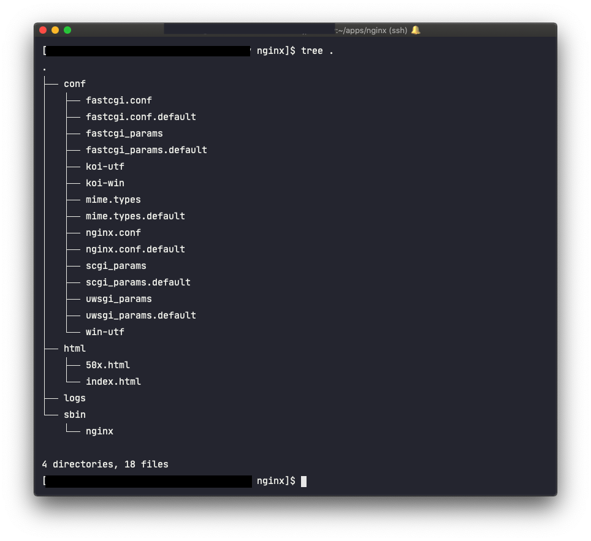

인턴 시절, 열심히 django 로 만든 어플리케이션을 배포할 때였다. '서버가 부족하니, 하나의 서버에 두개의 사이트를 올려주세요 🙂' 라는 과제를 받고 멘붕했었던 기억이 난다. 다행히, 마스터님은 과제만 던지고 사라지는 대신 nginx 의 기능을 사용하면 될 것이라는 실마리를 던져주고 가셨다. 그럼에도 해결을 못해서, 그날을 포함한 삼일 정도는 열시까지 야근하고 왕복 세시간 통근길을 울며 다녔다.


시간이 흘러, 내가 직접 FE 를 하진 않지만 nginx 배포만큼은 내가 해야하는 시점이 왔다. 휘발된 기억을 살리고 더이상 멘붕하지 않기 위해 정리해둔다. 

## nginx ?

세계에서 가장 많이 쓰고 있는 웹서버 중 하나. (다른 하나를 꼽자면 apache), 가볍고, 여러 요청을 한번에 처리할 수 있다는 장점때문에 사용량이 급등하는 추세다. apache 보다 동작이 단순하고 전달자 역할만 하기 때문에, **동시접속**에 특화되어있다.

### 왜 사용해야해? 

웹서버를 왜 사용해야하는지의 얘기를 해보자. 

일반적으로 웹서버는 크게 두 가지 역할을 한다.

1. 정적파일을 서빙하는 서버로서의 역할


  - 웹 어플리케이션 서버가 직접 html, css, javascript 같은 정보를 내려주면, 비즈니스 로직을 그만큼 처리할 수 없게 된다. 만약 클라이언트에서 정적파일만 요구하는 요청이라면 웹서버가 직접 내려줄 수 있다. 
    
2. 리버스 프록시로서 역할 
   

  잠깐! 리버스 프록시는 뭐지?

  - 프록시는, 클라이언트와 서버 통신 중간에서 **대신** 통신을 해주는 서버를 의미한다. 
  - 포워드 프록시는, 내부망에 함께 있는 클라이언트가 인터넷을 통해 어딘가에 있는 서버로 요청을 보내려고하면 이 요청을 받아 연결해준다. **클라이언트** 앞단에서의 처리! 
  - `리버스 프록시`는, 내부망의 **서버** 앞단에서 요청을 처리한다. 
    
    내부 서비스가 직접 서비스를 제공해도 되지만.. 이렇게 구성하는 이유는 보안때문이다. WAS(웹어플리케이션서버)는 대부분 DB 서버와 연결 되어있으므로, WAS 가 최전방에 있으면 보안에 취약해진다. 그때문에 리버스 프록시를 두고 사용한다면 WS 가 WAS 와 통신해서 결과를 클라이언트에 제공하는 방식으로 서비스를 하게 된다. 
    
3. 스위치로서의 역할도 가능


   - 프로세스 응답 대기를 막고, 요청을 배분하는 역할을 할 수 있다. 
    
## nginx 설치

설치는 가볍게 살펴보자. 설치는 다양한 방법으로 할 수 있다. 
```bash 
sudo apt-get install nginx # debian 계열 (ubuntu 등)
sudo yum install nginx # redhat 계열 (centos등)
```

단 centos등에서 yum repository 를 생성해야하는 등의 사전 준비가 있을 수 있으니, 정확한 내용은 http://nginx.org/en/linux_packages.html#stable 를 참고하자.
    
패키지매니저를 활용하기 어려운 상황이라면, 직접 압축파일을 내려받아서 푸는 방법도 있다. 

```bash 
NGINX_VERSION=1.14.2 # 최신 버전이나 stable 버전으로 설정
wget -q http://nginx.org/download/nginx-${NGINX_VERSION}.tar.gz
tar xvzf nginx-${NGINX_VERSION}.tar.gz

# 이후에 configure 후 make 하는 과정이 필요
```

## nginx.conf 를 뜯어보자!

nginx 가 설치된 경로를 찾아보자. 

```bash 
find / -name nginx.conf
```

해당 경로로 이동하면 이런 식의 기본 구조가 눈에 보인다. 



일단 여기서는 크게 두가지를 알아두자.

- `nginx.conf` 파일 

  - nginx의 설정이 들어가는 핵심 파일. 
    
- `conf.d` 폴더 

  - nginx.conf에서 include로 불러올 수 있는 conf 파일 저장 폴더.


## nginx.conf 의 설정 알아보기

생활코딩 페이지에 있는 아래 예제를 살펴보면, 익숙지 않은 예약어들이 있다. 

```bash 
worker_processes  1;
events {
    worker_connections  1024;
}
http { 
    include       mime.types;
    server {
        listen       80;
        location / {
            root   html;
            index  index.html index.htm;
        }
    }
}
```
 
- `worker_processes` : 몇개의 워커 프로세스를 생성할 것인지 지정하는 지시어. 1이면 모든 요청을 하나의 프로세스로 실행하겠다는 뜻. CPU 멀티코어 시스템에서 1이면 하나의 코어만으로 요청을 처리하는 셈이다. auto로 놓는 경우가 많다. 
  - 이와 같은 설정을 **core 모듈** 설정이라고 한다. nginx 설정값을 정하는 경우가 대부분 이에 해당한다. 
    
- `events` 블록 : 이벤트 블록은 네트워크 동작방법과 관련된 설정이다. 
    - `worker_connections` : 하나의 프로세스가 처리할 수 있는 커넥션의 수

    - 고로 최대 접속자수는 worker_processes X worker_connections가 된다. 🙂 

- `http` 블록 : 하위에 server 블록, 그리고 location 블록을 갖는 **루트 블록** 이다. 여기서 선언된 값은 하위 블록에 상속된다. 서버의 기본값이 된다. 
  - `include` : server 블록에서도 사용할 수 있다. `conf.d` 에 정의해놓은 파일들을 적용하는데 사용된다. 

 - `upstream` 블록: origin 서버라고도 한다. 여기서는 WAS 를 의미하고, nginx는 downstream에 해당한다고 할 수 있다. 여러 서버를 지정해두고, weight 을 정할 수 있다. 

    

    위의 그림처럼, upstream은 여러개를 만들 수 있다. 어떤 요청은 A로, 또다른 요청은 B로 보내고자 할 때 쓰인다. 대표적인으로 api 서버를 지정하고, FE에서 특정 location 요청을 proxy 할 때 쓰인다. 

    ```bash 
      upstream backend {
        server backend.juneyr.dev:443;
        keepalive 100;
      }

      server {
        listen       80;
        server_name  fe.juneyr.dev;

        location /v1 {
          proxy_pass https://backend;
        }
    ```

    - `server` : 값으로 `host주소:포트` 가 온다.

    - `keepalive`: keepalive 로 유지시키는 최대 커넥션 수. keepalive로 유지하면 매번 TCP handshake를 하지 않아도 된다. 

    - 자세한 값은 [공식 홈페이지](http://nginx.org/en/docs/http/ngx_http_upstream_module.html) 를 참고한다. 


- `server` 블록: 하나의 웹사이트를 선언하는데 사용된다.  server 블록이 여러개이면, 한대의 머신(호스트)에 여러 웹사이트를 서빙할 수 있다. 
  
  - 이런 개념을 **가상 호스트**라고 한다. 실제로 호스트는 한대지만, 가상으로 마치 호스트가 여러개 존재하는 것처럼 동작하게 할 수 있다.
    
    
    
    위 그림에서는 유저가 juneyr.dev, 그리고 augustyr.dev 로 각각 접속하는 경우를 나타낸다. 각각의 사이트는 같은 IP 머신(=호스트, 컴퓨터, 서버)로 연결되지만, 다른 페이지를 보여주도록 설정할 수 있다. 마치 정말 **다른 host**를 바라보는 것처럼!

  - listen : 이 웹사이트가 바라보는 포트를 의미한다. 

  - server_name: 클라이언트가 접속하는 서버 (주로 도메인). 이것과 실제 들어온 request의 header에 명시된 값이 일치하는지 확인해서 분기한다.
  
  - root : 웹사이트가 바라보는 root 폴더의 경로를 의미한다. 

- `location` 블록: server 블록안에 등장해서, 특정 웹사이트의 url 을 처리하는 데 사용한다. 예를 들어 `https://juneyr.dev/internal` 과 `https://juneyr.dev/apple-app-site-association` 로 접근하는 요청을 다르게 처리하고 싶을 때 사용할 수 있다.

```bash 
 location / {
    root /home/deploy/juneyr-dev;
    index index.html;
  }

 location /internal {
    return 200; 
  }

 location /apple-app-site-association {
    default_type application/json;
 } # 이 경로에 실제로 해당 파일이 있음
```
   - proxy_pass : 위에 설정한 upstream으로 넘길 수 있다. 

   - return : http status 코드를 임의로 넘길 수 있다. 


## nginx.conf 잘 관리하기

블록 내부에서 중복되는 값은 `conf.d` 폴더 하위의 설정으로 빼서 공통으로 적용할 수 있다. 그래서 잘 관리되는 `nginx.conf` 를 살펴보면, 대부분 include로 상세한 설정은 뽑아낸다. 

```bash:title=nginx.conf
worker_processes auto;

events {
  worker_connections 1024;
}

http {
  charset utf-8;
  include mime.types;
  default_type application/octet-stream;

  include conf.d/site.conf;
}
```

```bash:title=site.conf
upstream backend {
  server backend.juneyr.dev:443;
  keepalive 100;
}

server {
  listen       80;
  server_name  fe.juneyr.dev;

  include conf.d/static.conf;
  include conf.d/web-security.conf;

  location /v1 {
    proxy_pass https://backend;
  }
```

한번 nginx.conf 에 필요한 설정을 모두 넣기 시작하면 관리가 힘드니, 중간중간 리팩토링해주며 진행하는 것이 좋다. 


## 마무리 

nginx 는 가볍지만 강력한 웹서버이다. nginx만 가지고 무중단배포도 가능하고 [참고](http://www.yes24.com/Product/Goods/83849117), 로드밸런서 없이 가벼운 스위치 역할도 가능할 것 같다. FE가 있는 서비스를 제공한다면, 꼭 알아야겠지. 추가로 필요한 내용은 차후에 블로그 글로 더 정리하도록한다.   

## 참고 

https://whatisthenext.tistory.com/123

https://opentutorials.org/module/384/4526

https://nginx.org/en/docs/control.html#upgrade
- nginx 가 설정파일을 업그레이드 하는 방식. 읽어보면 좋을 것 같다. 
