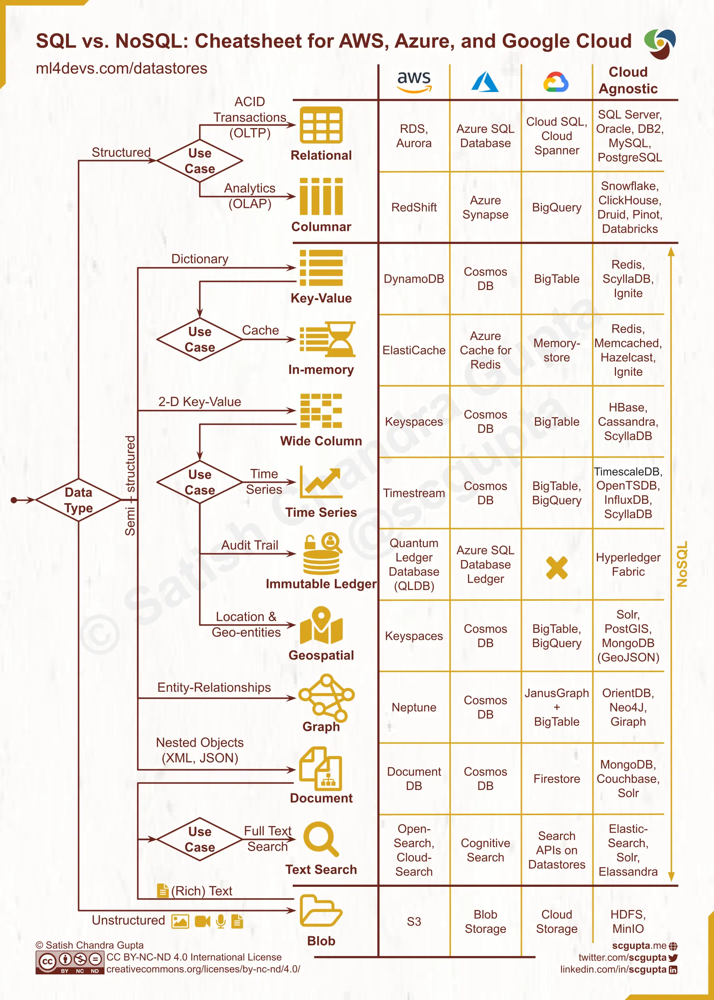

## 서론

mongoDB 스터디를 앞두고 있어, 상당히 빠르게 NoSQL 을 훑어야할 니즈가 생겼다. 마침 부교재로 `<NOSQL: 빅데이터 세상으로 떠나는 간결한 안내서>` 를 받았으니 이 안내서를 타고 한번 쭉 가보려고한다. 2013년 책이라 다소 부족한 내용도 있겠지만, 아는 만큼 채워나가면서 확인해본다.

## NoSQL 을 알려면 관계형 데이터베이스를 먼저 알아야해 

관계형 데이터베이스는 데이터를 테이블과 행, 즉 '관계와 튜플' 로 구조화 한다. 
**튜플**(tuple)은 이름-값 의 한 쌍이고 관계는 튜플들이 모인 **집합**이다.  

😁 관계형 데이터베이스는

- 트랜잭션을 지원하여 동시성 문제를 완화하고 
- 비교적 단순하고 아름다운 관계형 연산으로 많은 문제를 풀어줄 걸로 기대 되었지만 . . 

🤨 한편으로는 
- 객체와 관계형 데이터베이스 간 불일치, 즉 메모리 상에서는 복잡한 구조 (리스트 / 맵 / .. 등의 중첩 자료구조) 를 표현하고 있는데 관계형 데이터베이스는 이를 하지 못해서 최대한 단순하게 표현해야함 - 이를 **객체-관계 불일치** 라고 부른다.

때문에 많은 불만이 있기도했다. 지금이야 객체-관계 간 매핑 프레임워크(hibernate, myBATIS) 등이 널리 퍼져있어 좀더 완화되었지만, 이전에는 이를 직접 매핑하는 지루한 작업도 했어야했으니 좀더 그 불만이 크게 느껴졌을 터다. 

다만 조금 덧붙이자면,  최근에는 SQL 의 문법을 사용하는 관계형 데이터베이스이지만 여러 형태의 객체를 담는 형태도 많이 생겼다. 심지어는 json 의 형태를 그대로 저장할 수도 있다. (mysql 의 JSON 지원, postgreSQL 의 JSON, 화폐, 평면상 점 (point), 경로) 타입 지원 등을 살펴보면 관계형 역시 **여러 타입을 지원**하면서 부족한 지점을 메꾸기 위해서 노력하고 있다. 

'빅데이터' 시대가 도래하면서, 관계형 데이터베이스의 단점이 좀더 드러났다. 데이터와 트래픽이 기하급수적으로 증가하면서 많은 컴퓨팅 자원이 필요해졌고, **수직 확장** 과 **수평 확장** 사이에서 선택할 필요가 생겼다. 

모두가 잘 알고 있듯 수직 확장은 한대의 컴퓨팅 자원의 성능을 고급화해서 높이는 방식이다. 이 방식은, 해당 장비의 적용방식을 바꾸지 않아도 된다는 장점이 있으나, 비용적인 한계에 빠르게 직면한다는 단점을 안고 있다. 

수평확장은 반대로, 작은 장비를 여럿 모아 클러스터를 구축하는 방식이다. 장비 한대가 실패해도 전체 중단이 안되도록 구성하는 듯 변경이 수반되겠으나, 고가용성과 낮은 비용때문에 요즘의 서비스들은 이런 방식을 채택하고 있다. 

이때 관계형 데이터베이스는 클러스터에서 동작하도록 설계되지 않았다는 점이 드러난다. 적당한 양의 데이터라면, 여러 데이터베이스를 클러스터링해서 두되, 그중 몇가지만 RW(Read-Write)가 가능하고, 나머지는 Read 전용으로 두어 데이터베이스 접근성을 높일 수 있겠지만 . . . 🥲 지금 말하는 건 정말 큰 양의 데이터. 

물론 관계형 데이터베이스도 샤딩(sharding)을 통해서 클러스터 전체에 데이터 집합을 분산해서 뿌릴 수 있으나, 그렇게 되면 애플리케이션 단에서 샤딩을 고려해서 데이터를 질의해야하는 문제가 다시 생긴다. 샤딩에 대해서 잘 알지는 못하지만, [참고자료](https://techblog.woowahan.com/2687/)를 확인해보니 샤딩된 데이터를 질의하고, 나누는 역할의 컴포넌트는 또한 SPOF (Single Point of Failure)가 되는 것을 경계해야하는 문제 또한 생긴다. 
또한 관계형 데이터베이스가 자랑하는 참조 정합성, 트랜잭션, 일관성 제어같은 것은 기대하기가 어렵게 되거나 이를 위해서 좀더 조치를 취해줘야한다. 이를 두고 책은 '부자연스럽다' 라고 지칭했다.

그러니까 아무튼 관계형 데이터베이스는 이런 빅데이터 시대에 잘 휘두를만한 도구는 아니었던 것이다. 이런 관계형 데이터베이스와 클러스터 간의 부조화로 일부 회사와 조직들은 데이터 저장을 다른 형식으로 할 수 없을까. . . ? 🧐 하고 고민하게 된다. 

구글의 **빅 테이블**과 아마존의 **다이나모**는 그 결과 도래한 대표적인 NoSQL 데이터베이스다. 이를 계기로 많은 조직에서 클러스터 인프라에 적합한 형태의 데이터베이스를 탐구하게 되었다. 

## NoSQL 이라는 이름
우리가 인식하는 NoSQL 이라는 용어는 조핸 오스카슨이 빅 테이블 혹은 다이나모에 영감 받은 '새로운 종류의 데이터베이스'를 얘기하고 싶은 모임 이름을 고민하다 등장했다. 원래의 의도는 '오픈 소스, 분산, 비관계형 데이터베이스' 를 의미하고 싶어 등장했던 것이다. 해시태그하기 좋고, 검색할 때도 편리한 이름(...)으로 생각했던 것.

이렇게 SEO 최적화된 이름은, 딱히 모임의 의도와는 상관없이 매우 빠르게 퍼져나갔다. 최초에는 [Voldemort](https://www.project-voldemort.com/), [Cassandra](https://cassandra.apache.org/_/index.html), [Dynomite](https://www.dynomitedb.com/), [HBase](https://hbase.apache.org/), [Hypertable](https://hypertable.org/), [CouchDB](https://couchdb.apache.org/) , [MongoDB](https://www.mongodb.com/ko-kr) 가 참석했지만 지금와서의 NoSQL 은 이 7개에 국한된 것은 아니다. 여담으로 이 DB 들의 절반 정도가 apache 프로젝트로 들어갔다. 

그러면 결국 NoSQL 은 상당히 느슨한 개념이네, 하는 마음이 생긴다.  가장 분명한 점은 SQL 을 질의 언어로 사용하지 않는다는 것. 다만 이것도 지난 [카산드라 알아보기]( https://juneyr.dev/quick-cassandra) 에서 알 수 있듯이 SQL 을 사용하지 않을 뿐 상당히 유사한 CQL 이라는 것을 지원한다. 

그러면, 오픈소스 라는 성질은 어떤가? 비 오픈소스에도 NoSQL 이라는 이름은 손쉽게 사용된다. 대부분 오픈소스 현상을 의미한다고 보는 경우가 많긴 하지만! 

클러스터에서 실행될 목적이라는 내용은?  NoSQL 에는 흔히들 그래프 데이터베이스를 포함하는데, 그래프 데이터베이스는 딱히 클러스터에서 실행되는 것을 염두에두고 만들어지는 것은 아니다. 

NoSQL은 한편 스키마 없이 동작하고, 구조에 대한 정의를 변경할 필요없이 레코드에 자유롭게 필드 추가가 가능하다. 그러나 이또한 예외가 반드시 존재한다. 

이런 느슨한 특징의 집합을 가진 것이 NoSQL 이다. 결론적으로 대략 이런 특징을 가지면 NoSQL 이다. 하지만 이름에는 그렇게 집착할 필요는 없다. 

NoSQL 이 등장하고 많은 이들이 그 존재에 열광하게 된 이유는 많은 데이터를 다뤄줄 새로운 도구가 생겼기 때문이다. 즉 관계형 데이터베이스를 무조건 선택하기보다는 우리가 다룰 데이터의 형태와 흐름을 예측해서 적합한 데이터베이스를 고를 수 있는 길이 열렸다는 것. 이를 **다중 저장소 지속성**(polyglot persistence) 라고 부르기도한다. NoSQL 는 클러스터 규모의 데이터 접근을 편리하게 해줄수도 있고, 좀 더 편리하게 데이터를 조작할 여지를 우리에게 선물해줬다. 

선택지가 생긴 후의 우리는 다룰 데이터 타입에 따라 애플리케이션의 데이터 저장소를 잘 선택할 수 있는 여유가 생겼다. 아래 그림 처럼! 

 출처 : <a href="ml4devs.com/datastores">ml4devs.com/datastores</a>  

## NoSQL 이 데이터를 다루는 방법들 : 집합 지향이라는 말

위의 이미지를 잘 살펴보면, semi-structured 는 NoSQL 의 동치로 처리하고, 하위로  `key-value`  라는 형태, `document`,  `wide-column` 등을 발견할 수 있다. 방금 언급한 세가지 타입의 NoSQL 데이터 베이스는 '집합' 지향이라는 특질을 공유한다. 

관계형 모델에서는 저장하려는 정보가 '튜플(행렬의 행)' 으로 나눈다. 튜플은 제한적인데, 단순한 값을 모아놓은 것이어서 다른 튜플이 한 튜플안으로 들어간다는 개념 등을 지원하지 않는다. 이런 단순성이 관계형 모델을 지탱한다. 

집합 지향은 다른 접근법이다. 이 접근법에서 사람들이 더 복잡하게 데이터를 다루고 싶은 요구가 있다는 걸 인정한다. 방금 말한 3가지 타입의 NoSQL 데이터베이스 즉 `key-value` , `document`,  `wide-column` 는 리스트나 중첩레코드등을 허용한다. 이런 복잡한 레코드를 하나로 지칭하기 위해 **집합** (aggregate) 를 사용한다. 

집합 지향으로 작업할 때는 데이터 저장소와 상호작용하는 단위에 집중하게 된다.  논리적 데이터 속성보다는 애플리케이션에서 데이터가 어떻게 사용되는지에 관한 것이다. 고객과 주문이라는 도메인이 있다고 해보자. 애플리케이션에서 고객의 주문을 모두 가져오는게 중요하다면 고객 안에 주문이 포함된 집합으로 데이터를 뭉쳐서 다루게 될 것이다. 그게 아니라 개별 주문이 중요하다면 주문이라는 집합을 따로 뭉쳐서 다루게 된다. 그러니 데이터 모델링에서부터 도메인의 입장에서 진입하고, 집중하게 되는 면이 있다. 

관계형은 이러한 도메인적 관계에는 무지하다. 외래키 연결로 서로를 확인할 수는 있지만, 이게 도메인 상 하나의 덩어리라서 연결되어있는지 아닌지는 알 수 없다. NoSQL 의 graph 구조도 그러하다. 이런 것을 **집합 무지**(aggregate ignorant)라고 부른다. 집합의 경계를 잘 지어서 사용하는 것은 어렵기때문에, 다양한 방식으로 질의할 요구가 있다면 집합 무지의 데이터베이스를 사용하는 것도 방법이다. 없다면 집합 지향 데이터베이스가 좋다.

다시 돌아와, 집합 지향이 중요한 이유는 클러스터에서 동작하기 좋기때문이다. 클러스터에서 실행될때는 데이터 수집 시 질의해야하는 노드 수를 최소화해야한다. 집합을 잘 정한다면, 여러 노드에 필요한 정보를 나눠서 저장하게 되는 일을 방지할 수 있기때문에 좋다. 관계형 데이터 베이스를 샤딩해서 외래키를 타고 여러 노드를 순회하는 일과 비교해보면 이해가 쉽다. 

집합 지향은 트랜잭션에서도 관계형과 다르다. 관계형은 ACID 트랜잭션을 지원한다. 집합 지향은 대개 여러 집합을 포함하는 원자성은 지원하지 않는다. 다만 한번에 한 집합에 대한 원자성은 지원한다. 실제로는 집합이 잘 나뉘어있다면 해당 집합 내부에서 원자성이 필요하게 된다. 그러니 정말 중요한 건 **데이터를 어떻게 집합으로 나눌 것인지 정하는 것**이다. 

### 집합 지향 NoSQL 의 예제 

#### key-value 와 document 

key-value는 집합 구조가 불투명하다. 해서 무엇이든 저장이 가능하다.  그러나 집합의 일부를 질의하거나 할 수는 없다. 무조건 key를 통해서만 집합 (여기서는 value)에 접근할 수 있다.

반면 document 구조는 들어갈 수 있는 구조와 타입을 정의해서 그 안에 들어가는 것을 제한한다. 이런 구조때문에 데이터 접근할 때 융통성이 발휘되고, 집합의 필드를 이용해서 데이터베이스에 질의를 보낼 수 있다. 인덱스를 만들수도 있다. 

현실에서는 key-value 저장소와 document 저장소의 경계가 모호해지고 있다. document 저장소에 key-value 형식으로 검색하려고 id를 넣기도 한다. key-value 저장소인 redis는 불투명성을 없애는 방향을 지원한다(list 나 set 지원)

#### wide column / column family

[scylla db 설명](https://www.scylladb.com/glossary/wide-column-database/) 에 따르면, wide column 은 column family 와 동치인 개념이다. 여기서는 wide column 으로 지칭하겠다. (책에서는 column family 로 지칭)

wide column은 하나의 행이 있고, 행의 값이 map 형태로 되어있다는 점이 좀 다르다. 중첩  map이라는 표현이 좀더 이해하기 쉬울 것 같다. 
`{row key : {column key: column value}}`와 같은 형태로 되어있다.

행 전체 접근 뿐만아니라 특정 칼럼만 고를 수도 있다. 즉 get('613', 'blog') 와 같은 식으로도 가능하다. 

## NoSQL 이 데이터를 다루는 방법들 : graph와 무스키마 라는 말

위에 나왔던 집합형태로 데이터를 다루는 방식의 NoSQL 이 있는가 하면, 다른 형식으로 다루는 것도 있다. graph 형태가 그 예다. graph 데이터 베이스는 node가 간선(edge)로 연결된 그래프를 다룬다. 엔티티를 노드에 저장하며, 간선으로 엔티티 간 관계를 나타낸다. 간선은 방향성을 가지며, 구조를 만들고 나면 그 간에 존재하는 패턴을 포착하기 좋다. 해서 그래프 데이터베이스는 소셜 네트워크나 제품 선호도와 같은 데이터를 다루는데 이상적이다. 

한편 무스키마라는 말도 NoSQL 이 데이터를 다룰 때 많이 접하는 말이다. 이 말은 좀 오해의 소지가 있는데, NoSQL 데이터베이스에 데이터를 저장할 때는 스키마를 고려하지않아도 되는 것은 사실이나, 애플리케이션에서는 결국 스키마를 정의해야한다. 애플리케이션이 데이터를 읽어서 해석하고, 저장할 수 있어야하기때문이다. 애플리케이션 단에서 타입과 이름을 명확하게 정의해야 데이터를 읽을 수 있는 것은 당연한 이야기이도 하다. 

무스키마 형태에서 변경이 일어나면, 먼저 애플리케이션에서 정의된 값을 변경하게 된다. 몽고 DB에서 `price`라는 값을 `fullPrice` 로 바꾼다면, 새로 추가되는 문서와 그걸 읽는데는 문제가 없지만, 기존 문서에 대해서는 값을 못읽게 된다. 이런 식으로 애플리케이션 스키마와 데이터베이스 간에 스키마 불일치가 발생할 수 있다는 점은 염두에 두어야한다. 이런 경우 점진적인 마이그레이션 (incremental migration) 등을 통해 해결할 수 있다. 

### 마치며 

이렇게 NoSQL 의 개념, NoSQL 이 데이터를 다루는 다양한 형태를 간략하게 살펴봤다. NoSQL 은 SQL를 질의언어로 사용하지않으며, 대체로 오픈소스이고, 클러스터형태의 데이터 저장에 유용하며 스키마가 없이 동작한다는 느슨한 형태의 특징을 공유하는 데이터 스토어를 지칭하는 말이다. 느슨한 만큼 그 형태도 다양하기에, 관계형 데이터베이스를 대체할 수 있고 데이터의 사용형태를 지원하는 도구로 생각하고 하나하나를 구체적으로 탐구하는 것이 좋을 것 같다. 생각해보면 이미 모두들 너무 잘 사용하고 있는 Redis도 NoSQL 도 하고.. 최근에는 NoSQL 의 형태가 매우 다양해지고 그 사용도 적극적인 만큼, 사례를 탐구해보면 더 재밌을 것 같다.

내가 눈독들여보고 있는 사례는 다음과 같다. 

- [와디즈의 graph DB Neo4j 도입기](https://blog.wadiz.kr/%EA%B7%B8%EB%9E%98%ED%94%84-%EB%8D%B0%EC%9D%B4%ED%84%B0%EB%B2%A0%EC%9D%B4%EC%8A%A4%EB%A1%9C-%EC%B9%9C%EA%B5%AC-%EC%84%9C%EB%B9%84%EC%8A%A4-%EB%8F%84%EC%9E%85%ED%95%98%EA%B8%B0/)
- [LINE 알림 센터의 메인 스토리지를 Redis에서 MongoDB로 전환하기](https://engineering.linecorp.com/ko/blog/LINE-integrated-notification-center-from-redis-to-mongodb)
- [디스코드는 어떻게 수조개의 메시지를 저장하는가 - 카산드라에서 scylla db로 전환한 사례](https://discord.com/blog/how-discord-stores-trillions-of-messages)

## 참고 

- 프라모드사달게이, & 마틴파울러. (2013). _NoSQL : 빅 데이터 세상으로 떠나는 간결한 안내서_. 인사이트.

