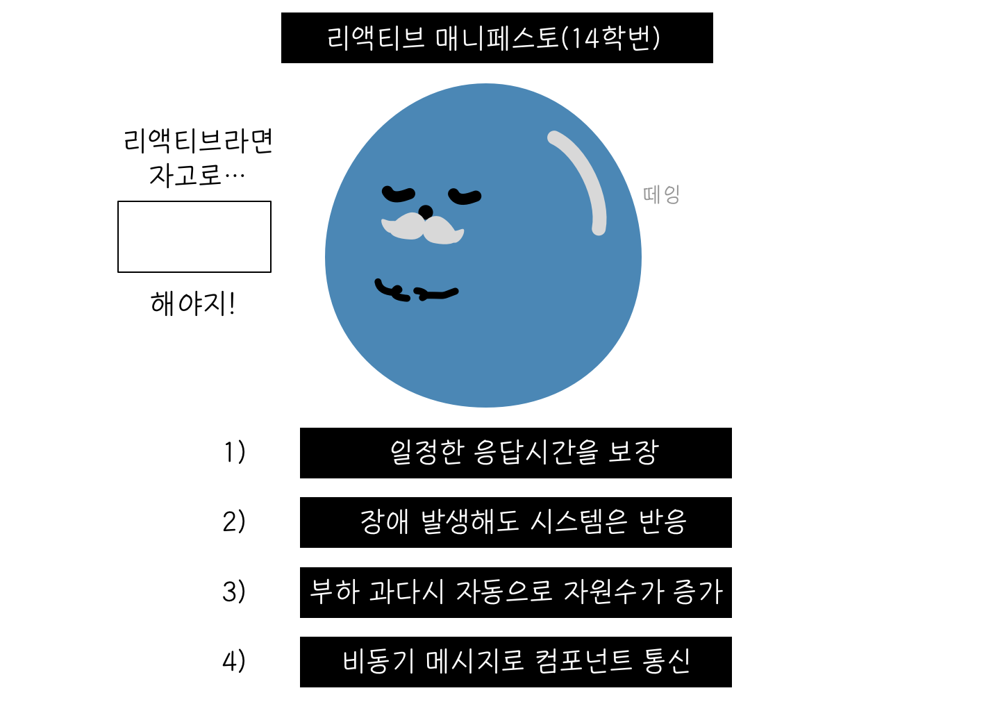
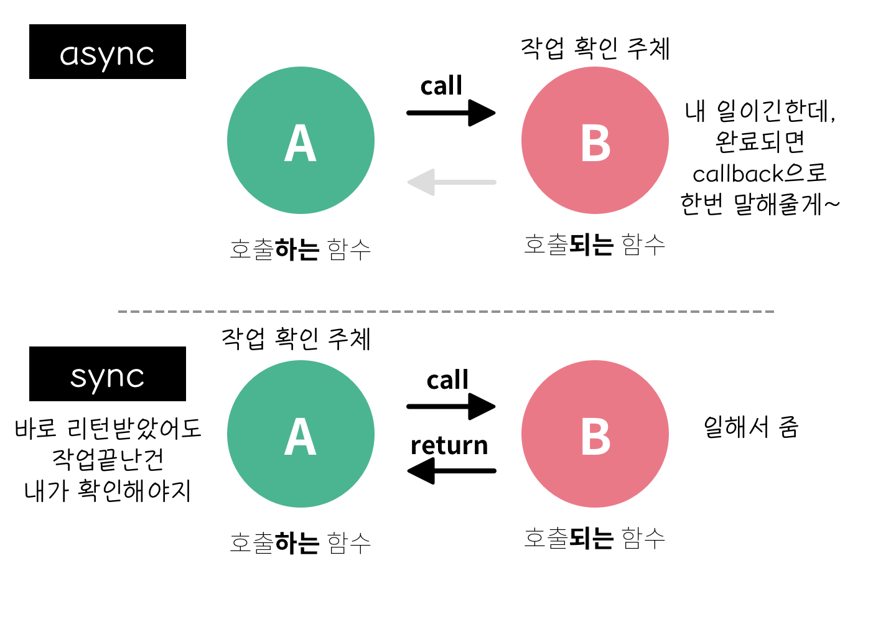
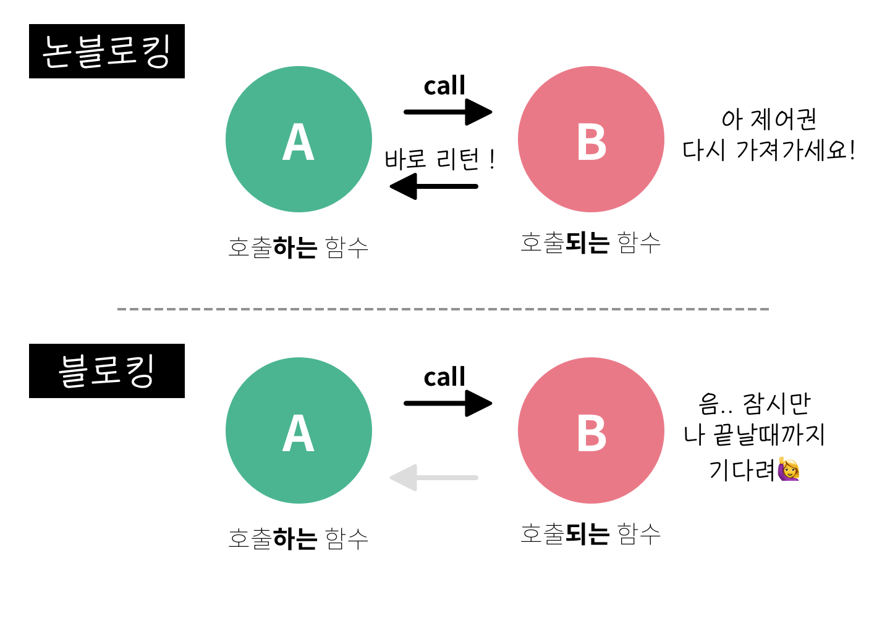
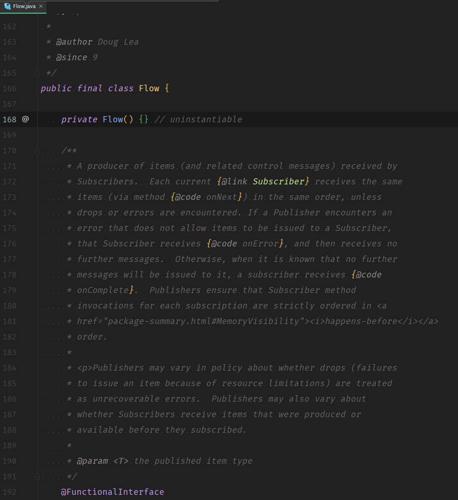

그날이 왔다. 여러가지 api 콜을 합쳐서 다시 하나의 응답으로 만들어 내보내주는 코드를 보는데, 이해를 전혀 못하겠는 때가.. 그래서 이번주는 Reactive Programming  101이다.

처음에 구현체로 내가 마주한 건 바로 Project Reactor다. [Project Reactor](https://projectreactor.io/) 는 Spring 프레임워크를 만든 pivotal에서 제공하는 오픈소스 프로젝트로, 자바/스프링 환경에서의 리액티브 프로그래밍을 할 수 있게해준다. [Reactive Stream](https://www.reactive-streams.org/) 규약을 기반으로, [Reactive X](https://reactivex.io/) 에서 영감받은 방식의 프로그래밍을 구현한 프로젝트다. 

실제로 구현체를 열심히 뜯어봤자, 개념을 모르면 잘 못쓴다는 걸 이제 2년차의 킴은 알고 있기때문에, 리액티브 프로그래밍 개념을 간단히 짚고 넘어가자🤓

## 리액티브 프로그래밍 

모던 자바 인 액션에서는 리액티브 프로그래밍이 등장한 배경을 간략하게 설명한다. 수년 전 까지, 우리가 생각하는 대규모 어플리케이션은 그냥 수십대의 서버를 운용하고, GB 정도의 데이터, 몇초정도 걸리는 응답시간, 유지보수는 몇시간 정도 걸리는 것이 당연했다. 하지만 지금은 어떤지 생각해보자. 🤔 성질 급한 나는 수초의 응답이 걸리는 페이지는 그냥 닫아버린다. 

이렇게 환경이 변화한데는 이유가 있는데, 

- 빅데이터: 빅데이터는 보통 PB(페타바이트) 단위로 구성되고, 거기에 매일 증가해버린다. 
- 다양한 환경: 비슷비슷한 디바이스가 아니라 작은 모바일 디바이스부터 수천 개의 멀티 코어 프로세서로 실행되는 클라우드 클러스터까지 ! 너무도 다양한 환경에 애플리케이션이 배포됨.
- 사용 패턴: 사용자는 1년 내내 항상 서비스를 사용할 수 있고, ms 단위의 응답시간을 기대한다. 👽

 리액티브 프로그래밍에서는 다양한 소스에서 들어오는 데이터의 흐름(스트림)을 **비동기적**으로 합쳐서 이런 문제를 해결한다. 

### 그래두.. 아직 어떨때 쓰면 좋은지 모르겠는데요? 🥺 
[우아한형제들 기술블로그](https://woowabros.github.io/experience/2019/03/18/tech-toby-reactive.html) 에서는 간단한 예제로 사용 이유를 설명하고 있다. 

> 여러 API를 취합해서 전달해야하는 시스템에서는 SUM([각 API들의 경과시간]) 만큼 필요합니다. 반대로 리액티브로 진행할 경우, 여러 API 중 MAX([각 API들의 경과시간]) 이 필요합니다. 

이전에 사용하던 것 처럼 sync 하고 blocking 하게 요청을 한다고 하자. API 요청이 n개가 있으면 이를 하나 호출하고 받을 때까지 다른일을 할 수 없기때문에 n개의 요청 시간을 모두 합친만큼 걸린다. 하지만 리액티브 시스템을 사용하면 요청을 비동기적으로 **동시에** 보내기때문에 이 중 가장 긴 요청 시간만큼만 걸린다. 

### 리액티브 메니페스토 (선언)

리액티브 메니페스토는 리액티브 애플리케이션과 시스템 개발의 원칙을 공식적으로 정의하고 있다. 

- 반응성(responsive) : 리액티브 시스템은 빠를 뿐 아니라 + **일정하고 예상가능한** 반응 시간을 제공한다. 
- 회복성(resilient) : 장애가 발생해도 시스템은 반응해야한다. 여러 컴포넌트의 시간과 공간 분리 (즉, 컴포넌트가 각각 독립적인 생명주기를 갖고 다른 프로세스에서 실행), 작업 위임시 비동기적으로 위임하는 등의 기법이 있다. 
- 탄력성(elastic) : 애플리케이션의 생명주기 동안 다양한 부하를 받는데 이때  리액티브 시스템에서는 자동으로 관련 컴포넌트에 할당된 자원 수를 늘린다. 
- 메시지 주도(message-driven) : 회복성과 탄력성을 지원하려면 약한 결합, 고립, 위치 투명성 등을 지원하도록 경계를 명확히 정의한다. 또한 비동기 메시지를 전달해 컴포넌트 간 통신이 이뤄진다. 
  
  

### 애플리케이션 수준의 리액티브 

애플리케이션 수준 컴포넌트의 리액티브 프로그래밍의 기능은 **비동기**로 작업을 수행할 수 있다는 점이다. 잠깐 여기서 비동기/동기와 블로킹/논블로킹을 짚고가자.

#### async/sync vs blocking/non-blocking
 
비동기 (async) 적인 프로그래밍을 다루기 전에, 비동기/동기 그리고 블로킹 / 논-블로킹을 먼저 다뤄야한다. 

간단히 생각해보면 async와 논 블로킹이 같은 개념이고, sync와 블로킹이 같은 개념처럼 느껴진다. 비동기로 일을 던져주면, 호출한 함수 A는 호출된 함수 B가 응답할 때까지 기다리지 않고(non-blocking)하게 일할 수 있으니까. 반대로 동기로 일을 던지면 호출된 함수 B가 다시 결과값을 넘겨줄 때까지 호출한 함수 A는 기다리는(blocking) 상태가 된다. 

하지만 이 두가지 개념은 관점의 차이가 있다. 

sync/async : 호출되는 함수 B의 작업완료 여부를 누가 신경쓰느냐가 주제다. 
   - 호출하는 함수 A가 호출된 함수 B의 작업 완료 후 리턴을 기다리거나, 혹은 바로 리턴받더라도 작업 완료 여부를 A가 직접 신경쓰면 sync
   - B에게 callback을 전달해서, B의 작업이 완료될 때 B가 callback을 실행하고, A는 그때서야 받는 구조. 즉 A가 작업의 완료 여부를 신경스지 않으면 async 
     
     

blocking/non-blocking: 호출되는 함수가 바로 리턴하느냐, 마느냐 
  - 호출된 함수 B가 바로 리턴해서 A에게 다시 제어권을 넘겨주고, A가 다른 일을 할 기회를 준다면 non-blocking
  - 호출된 함수가 자신의 작업을 마칠때까지 대기하게 만든다면 blocking 
    
다시 돌아와서, 이벤트 스트림을 블록하지 않고 비동기로 처리하는 것이 최신 멀티코어 CPU의 사용률을 극대화 할 수 있는 방법이다. 
스프링 5 이전 (리액티브 프로그래밍을 하기 이전) 오랫동안 자바 개발자에게 동시성 = `많은 쓰레드` 였다. 쓰레드 별로 다른 일을 하도록하면 쓰레드 갯수만 늘리면 동시에 여러 일을 처리하게 할 수 있었으니까. 그런데 시스템이 점점 분산되고(MSA) API 호출, 데이터 액세스등의 이유로 IO 수행시간이 늘어났다.(=쓰레드 점유) 

많은 쓰레드로 해결을 할 때는 몇가지  문제가 있다. CPU와 메모리가 충분해도 쓰레드가 부족하면 처리율이 내려가고, 쓰레드를 늘리면 CPU와 메모리에 엄청난 부하가 간다. 쓰레드를 변경할 때 사용되는 비용이 CPU 에 부하를 주기때문에 이 역시 문제다. 쓰레드는 그래서 상대적으로 비싸고 희귀한 자원이다. 

리액티브 프레임워크와 라이브러리는 쓰레드를 퓨처, 액터, 일련의 콜백을 발생시키는 이벤트 루프등과 공유하고 처리할 이벤트를 변환하고 관리한다. 이 기술은 쓰레드보다 가볍다 🕊 ! 

### 프로그래밍에서의 리액티브 : 리액티브 프로그래밍 

리액티브 프로그래밍은 리액티브 스트림을 사용하는 프로그래밍이다. 리액티브 스트림은 무한(이라고 생각 할 수 있는)의 비동기 데이터가 순서대로, 그리고 블록하지 않는 역압력(backpressure)를 전제해 처리하는 표준 기술이다. ..역압력은 뭐야?
역압력은 pub-sub 프로토콜에서 이벤트 스트림의 subscriber가 이벤트를 소비하는 속도 < publisher가 이벤트를 발행하는 속도 를 보장해서 문제가 발생하지 않도록 하는 장치를 말한다. 이래야, 부하가 발생한 컴포넌트가 완전 불능이 되거나 예기치 않게 이벤트를 잃어버리는 등의 문제가 발생하지 않는다. 역압력은 즉, 비동기 작업이 실행되는 동안 암묵적으로 블록 API를 사용해서 제공한다. 이런 기법은, subscriber가 스레드를 블록하지 않고도 감당 못할만큼의 데이터를 받는일을 방지한다. 

리액티브 스트림 프로젝트는 넷플릭스, 레드햇, 트위터 등의 쟁쟁한 회사들이 참여해서 최소 기능 집합을 네개의 인터페이스로 정의했다. Java9 의 Flow 클래스 뿐 아니라 위에서 말한 Spring reactor, RxJava(넷플릭스) 등 많은 서드 파티에서 이 인터페이스를 구현한다. 

### Java 9의 Flow 클래스로 맛만 보기 
Java 9에서는 리액티브 프로그래밍을 제공하는 클래스 `java.util.concurrent.Flow` 를 추가했다. 

## 참고 
모던 자바 인 액션(2019, 한빛미디어) 
https://woowabros.github.io/experience/2019/03/18/tech-toby-reactive.html
https://homoefficio.github.io/2017/02/19/Blocking-NonBlocking-Synchronous-Asynchronous/

https://tech.kakao.com/2018/05/29/reactor-programming/

https://javacan.tistory.com/entry/Reactor-Start-1-RS-Flux-Mono-Subscriber

https://luvstudy.tistory.com/100
