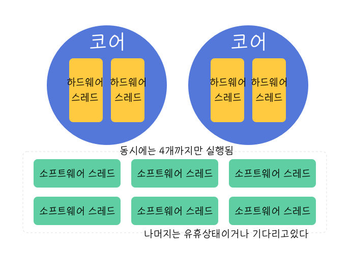

### 서론
> notice : 모던 자바 인 액션 관련 글은 책의 저작권 이슈를 우려해서 삭제했습니다. 

[CompletableFuture 의 비동기 처리](https://juneyr.dev/modern-java-4)를 공부하다가 비동기 작업을 다시 merge하는 작업, 즉 thenCompose 와 thenCombine 등에서 두 가지 버전을 지원한다는 사실을 알게 되었다. 

- thenCompose 는 넘겨받은 함수 작업을 현재와 같은 thread에서 실행한다. 
- thenComposeAsync 는 넘겨받은 함수 작업을 새로운 thread에서 실행한다. 
  
이외에도 비동기 작업에서는 계속 thread 개념이 등장하는데, 이렇게 정리하다보니 자연스럽게 궁금해지는 지점이 있었다. 

> 자바에서 말하는 스레드는 100개, 200개도 가능한데, 1코어에 1스레드가 동작한다는 것은 무슨 말일까? 

## 그건 바로 하드웨어 스레드와 소프트웨어 스레드의 차이 ⚡️

검색해보니, 바로 하드웨어 스레드와 소프트웨어 스레드의 차이라는 것을 알게되었다 💪 무의식적으로 사용하던 스레드라는 용어에 이제는 구분 지을 때가 왔다고 생각하면 간단할 것 같다.  

하드웨어 스레드를 설명하려면 CPU 코어부터 설명해야하니까 , 천천히 CPU 부터 다시 짚어보도록 하자. 

### CPU, 코어, 하드웨어 스레드
CPU 는 Central Processing Unit 이라는 말처럼, 컴퓨터의 뇌 역할을 하는 하드웨어다. CPU 안에 **물리적인** 계산을 실제로 진행하는 유닛을 **코어 core** 라고 한다.

CPU 하나에 코어는 하나겠네?! 라는 생각이 들겠지만..  하나의 CPU 에 하나만 있는건 아니다. 실제로 CPU 는 2코어(듀얼코어), 4코어(쿼드코어), 8코어(옥타코어) 를 지원하는 것이 일반적이고, 점점 더 늘어가는 추세다. 즉 하나의 CPU가 여러 계산을 동시에 병렬적으로 할 수 있는 여력이 늘어간다는 것! 

그럼 하드웨어 스레드는 뭘까? 하드웨어 스레드는 **os가 스케쥴 해줄 수 있는 최소 단위의 일 (=instruction의 모음)**이다. 1코어는 1스레드를 지원하고 있다. 한 명의 사람이 대개 하나의 일만 맡아서 하는 걸 생각하면 되겠다. 그런데 요즘에는 1코어가 2스레드 이상을 지원하는 경우도 비일비재하다. 1스레드로 1코어의 성능을 모두 사용하지 못하는 일이 자주 생기자, 하이퍼스레딩이라는 개념을 도입해서 1코어:n개의 스레드를 지원할 수 있게 되었다 🧘‍♀️  

그러니까 2코어인 경우 4스레드를 지원하는 경우도 있다는 뜻이다. 여기서의 하드웨어 스레드 갯수는 보통 **동시에 실행 가능한 스레드 갯수** 와 동의어라고 보면된다. 

### 소프트웨어 스레드 

2코어 4스레드 머신이어도, 자바프로그램에서는 `Executors.newFixedThreadPool(100)` 이라는 식으로 스레드 갯수를 훨씬 많이 설정할 수 있다. 여기서의 스레드는 **소프트웨어 스레드**를 의미한다. 이 스레드는 소프트웨어 상에서 병렬적으로 task 를 나누고, 일을 할당할 때 쓰인다. 이 스레드가 고대로 하드웨어 스레드에 올라가서 사용된다. 즉, 소프트웨어 스레드가 100개가 있다고 하더라도 동시에 실행될 수 있는 스레드는 하드웨어 스레드 갯수와 같다. 2코어 4스레드 라고 하면 동시에 네개의 스레드가 실행이 가능하다! 

참고에서의 예시가 인상 깊어서 여기에 옮겨본다. 
'4코어 8(하드웨어)스레드 라는 것은, 상하권이 나뉜 4세트의 책과 같습니다. 이 4세트를 가지고 도서관에서 100명의 사람에게 빌려 줄 수 있습니다. 비록 한번에 읽을 수 있는 사람은 8 사람 (소프트웨어 스레드) 밖에 없지만요.' 

그럼 나머지 소프트웨어 스레드는 어떻게되는 걸까? 나머지 스레드는 실제로 일할 task 가 없어서 쉬고있거나(유휴상태) 하드웨어 스레드에 올라갈 자신의 차례를 기다리고 있다.

### 결론 
소프트웨어 스레드와 하드웨어 스레드는 다른 개념이다. 이 사실을 인지하고 병렬 프로그래밍을 공부하면 좀더 수월하게 학습할 수 있으니 꼭 알고 넘어가는 것을 추천한다.  

### 참고 

https://jista.tistory.com/98

https://kldp.org/node/154708

https://velog.io/@dvmflstm/CPU-%EC%8A%A4%EB%A0%88%EB%93%9C-%EC%86%8C%ED%94%84%ED%8A%B8%EC%9B%A8%EC%96%B4-%EC%8A%A4%EB%A0%88%EB%93%9C

