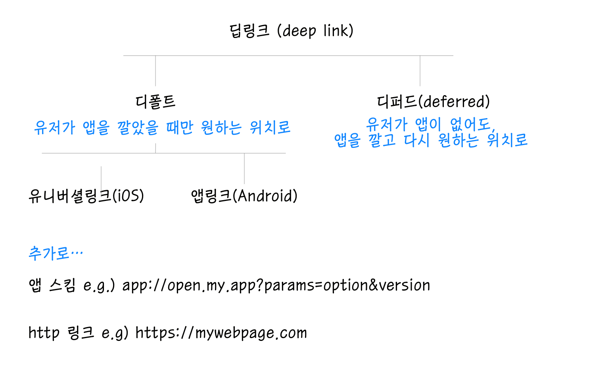

## 히스토리 
팀에서 유니버셜 링크 담당하시던 분이 휴직하시면서 이번 프로젝트에서는 어떻게 제공해야하는지 내용을 남기고 가셨다. 
추적하면서 서버입장에서는 어떻게 해야하는 건지 다시 또 정리해보고싶다. updated 기준일에는 이미 돌아오셔서 내용을 보충해주셨다 =) 


## 유니버셜 링크? 딥링크? 

먼저 짚고 넘어가자. 유니버셜 링크라고 이야기하지만, 유니버셜 링크는 iOS 에서만 작동하는 딥링크의 한 종류이다. 

딥링크, 혹은 딥링킹(deep linking) 이 뭘까? 딥링크를 사용하면 유저가 앱과 앱을 오가는게 쉬워진다. 
웹을 보다가, 특정 화면만 유저가 앱으로 봤으면 하는 경우 딥링크가 작동하는데, 이때 유저가 앱을 깔아두었으면 바로 해당화면으로 이동합니다.

웹을 서핑하다가 앱으로 보내려고할 때 ... 
`if` 그 서비스에 해당하는 앱이 있다면 
1) 앱으로 간다.

`else` 앱이 없다면
- 에러를 발생시킨다.

- 1) 보통 해당하는 store (app store, play store) 로 이동하거나 

- 2) 해당하는 웹 링크로 이동한다.

이 기능을 가능하게 해주는데 딥 링크이다.

딥링크의 형태는 앱 스킴(URL 스킴) 혹은 일반적인 `https://` 링크 두 가지 형태를 둘다 지원한다. 즉 `https://www.example.com` 혹은 `app://open.my.app` 두 형태를 모두 지원한다는 말이다. 눌렀을 때 필요한 앱을 직접 선택할 수 있도록 한다는 특징이 있다.


우리는 모바일 시대를 살고 있으므로, 이 기능을 아주 많이 쓰게 된다. 
예를 들어보자. 새로운 모바일 게임 출시 사전등록을 했다. 🎲
출시 당일이 되면 링크 하나가 문자로 날라온다. 이 링크를 클릭하면, 웹페이지 하나가 잠시 떴다가 스토어로 자동으로 이동한다. 
왜? 나는 이 게임 앱을 깔지 않았으니까! 

앱을 설치한 이후에 이 링크를 한번 더 누르면, 바로 게임이 열린다. 🙌
이때 우리는 순간적으로 딥링크를 사용한 것이다. 

다음으로 넘어가기전에 전체적인 개괄을 보자. 




## 그냥 딥링크, deferred 딥링크

위에서 딥링크를 설명했다. 그런데 딥링크에는 크게 두가지 타입이 있다. 

1. default 
   default deep link 는 **유저가 이미 앱을 깔았을 때만** 원하는 화면으로 이동한다. 앱이 없는 경우 에러를 띄웁니다. (여기에서, 개발자가 앱스토어로 이동할 건지 웹에서 남을 건지 결정해서 구현한다.) 즉, 미리 앱을 깐 유저들을 다시 데려오고 싶은 목적일 때만 유용하다.
   
2. deferred 
   defered deep link는 훨씬 복잡하다. 이 딥링크는 앱이 깔려있지 않은 유저를 App이나 Play Store로 데려간 다음, 설치된 뒤에는 **원래 보고싶었던 페이지를 띄우게 한다.**
  
  그래서 만약 신발 광고를 클릭해서 앱을 다운로드하면, 유저는 스토어로 라우팅되었다가 - 앱이 설치되어 열리는 순간에 해당 신발의 페이지가 뜬다.
  
  deferred deep link 는 Adjust (혹은 firebase) 같은 딥링킹 솔루션으로만 가능하다. 이 솔루션은 SDK 로 앱에 탑재하도록 제공하고 하고 있다. 이 부분의 설명은 adjust 의 설명을 참고한 것이라 이렇게 홍보가 들어가있다. =) 
  
## 앱 스킴과 http 링크

### 앱 스킴 App Scheme (URL scheme)

앱으로 이동하는 url scheme은 이런 형식을 띈다.
```bash
naversearchapp://명령어?파라미터=옵션&버전
```

이름만 봐도 네이버 검색앱 (아마 네이버 모바일이겠지?)으로 가는 스킴같다. 

이 링크를 클릭하면, 모바일에서는 이렇게 인식한다.

- 위 scheme이 링크된 하이퍼 링크를 클릭한다. scheme이 시스템에 전달된다. 

- 시스템에서 전달된 url scheme을 보고, '실행가능한 앱이 있나..? 🤔' 확인

- url scheme을 받을 수 있는 앱이 있다면 해당 앱을 실행시키며 url scheme을 전달

- 앱이 실행되면서 url을 참조해서 필요한 화면을 띄우거나 이동시킴

여기서 
- if 앱이 있으면 앱이 실행된다. (iOS, Android 공통) 

- else 앱이 없으면 

  - iOS : 해석불가능한 url scheme이므로 오류 팝업 혹은 페이지가 뜬다. 

    - 이 경우, appstore 링크로 이동해서 앱설치를 유도할 수있다. 

  - Android: intent scheme을 사용하면 자동으로 구글 플레이로 이동한다.

    - intent scheme에는 `intent://<내용>;scheme=naversearchapp;action..` 등으로 intent로 구현되어있다. (intent는 안드로이드에서 페이지 간 이벤트를 전달하기 위해 사용하는 방식이다.)

    - intent가 없는 일반 scheme을 이용한 경우 iOS와 동일한 방식으로 예외처리 가능(구글 플레이로 링크해서 앱설치 유도)

원래 앱과 웹을 연결할 때는 이렇게 URL 스킴만을 사용해서 진행하곤 했다. 실제로, 푸시메시지에는 이렇게 URL 스킴만 내려주어도, 해당 푸시를 누르면 해당 앱으로 이동한 뒤 스킴을 적용하기 때문에 원하는 페이지로 갈 수 있다.

### http url 
그러나 http url 형태를 사용하면 사용자의 OS 버전에 상관없이 원하는 앱 화면으로 이동시킬 수 있다. 즉 일관성있으며, http url은 유일하다는 장점이 있다. app scheme 은 사실 앱 들 간에 겹칠 수도 있는 정보이기 때문이다. 


## 딥링크 iOS버전: universal link 

딥링크이긴하지만, universal link 는 url 형태로만 동작한다.

- iOS 9+ 버전에서만 에서 동작 

- url 형태로 동작 

- 해당 url 상위 페이지에 `apple-app-site-association` 파일을 서빙해주어야함. 이 파일은 app이 처리할 수 있는 URL을 json 형태로 명시해둔 것.

- 보통 root 와 `.well-known` 디렉토리에 둘다 서빙  

universal 링크는 deep link 와 똑같이 동작한다. 

1) 앱이 깔려있다 -> 앱으로 이동 

2) 깔려있지 않음 -> 웹으로 이동 / app store로 이동 

이 작업을 위해서는 서버와 앱의 수정이 필요하다. 

링크가 되는 웹 서버에 다음을 설정해주어야한다. [Apple 공식 가이드](https://developer.apple.com/library/archive/documentation/General/Conceptual/AppSearch/UniversalLinks.html) 를 참고.


#### 웹서버 작업
- apple-app-site-association 이라는 파일을 만든다. json 내용이지만 json 확장자로 저장은 하지 않는다.

  - 예시는 https://gist.github.com/anhar/6d50c023f442fb2437e1 를 참고함. 

  ```json
  {
    "applinks": {
        "apps": [],
        "details": [
            {
                "appID": "<TEAM_DEVELOPER_ID>.<BUNDLE_IDENTIFIER>",
                "paths": [ "*" ]
            },
            {
                "appID": "<TEAM_DEVELOPER_ID>.<BUNDLE_IDENTIFIER>",
                "paths": [ "/articles/*" ]
            },
            {
                "appID": "<TEAM_DEVELOPER_ID>.<ANOTHER_APP_BUNDLE_IDENTIFIER>",
                "paths": ["/blog/*","/articles/*"]
            }
        ]
    }
  }
  ```

- TEAM DEVELOPER ID는 AABBB123CCC 라는 식으로, 숫자와 대문자가 혼재된 형태

- apps는 empty list로 놔둘 것 

- paths는 웹이 아니라 **앱이** 지원하는 문자열 배열이라고 한다. 모든 문자가 가능하면 그냥 *, 포함하고 싶지 않으면 `"NOT /videos/wwdc/2020/*"` 과 같이 표시.

- **HTTPS**인 웹서버 경로에 apple-app-site-association(aasa) 파일을 업로드한다. 루트나 `.well-known` 서브 디렉토리에 올리세요.

> 웹서버에 한번만 올릴거라면 `scp`로 파일을 업로드하고, 로그인한뒤 해당 파일을 `/var/www` 등 root 경로에 옮기자. 

- nginx 설정을 하자.

  ```conf
  // conf.d/site.conf
  server {
  // 중략 
  listen 443; // https 에서 동작해야한다. 
  
  root <홈경로> 
  
  location /apple-app-site-association {
  default_type application/json;  
  }
  }
  ```

#### iOS 앱 작업 
AASA(apple-app-site-assocition) 에 정의한 대로,범용 링크를 처리하도록 앱을 변경하자.

- Xcode 에서, applinks:<도메인이름> 설정을해야함.

- 한 도메인이 여러 앱이랑 엮일 수 있고, 거꾸로도 가능함 (M:N 구조)

- 앱 개발자가 UIApplicationDelegate 메소드를 적용해야함.  

  - `https://yourdomain.com/dress` 를 앱과 관계를 매핑해놓는다고 하자. AASA 파일에는 `"paths:": ["/dress"]` 형태로 들어간다. 사파리에서 유저가 이 `https://yourdomain.com/dress`를 클릭하면 
     - 앱이 깔려있으면 앱이 열리고 이 주소가 UIApplicationDelegate로 넘어간다. 앱에서 이 주소면 어떤 view를 열어줄지 결정
     - 앱이 안깔려있으면, 이 주소 자체가 사파리에서 열림. 이 도메인에서 바로 상품을 보여줄수도 있고, 앱스토어로 리다이렉트할 수도 있음. 

#### universal 링크의 예외적인 동작 
    - 사파리와 크롬에서만 동작함 

    - 다른 사이트가 유니버셜링크로 리다이렉트해도 동작하지않을 수 있음. 이메일 앱에서 `https://yourdomain.com/dress/1`으로 리다이렉트하는 링크 A를 클릭하면 딥링크 동작안함. 하지만 사파리에서 이 링크 A를 클릭하면 동작함. 

    - 바로 링크를 주소창에 넣으면, 유니버셜링크 동작하지않음

    - redirect를 자바스크립트로 한 경우면, 유니버셜링크 동작하지않음

    - openUrl 등으로 앱 안에서 링크를 열면 동작하지않음

### 딥링크  Android 버전: 앱링크 App Link 

**개발자의 웹사이트라는게 확인된** 웹사이트 URL 기반의 딥 링크이다. 이 링크 중 하나를 클릭하면 설치되어있는 앱이 즉시 열리며, 앱 선택 대화상자는 표시되지 않는다. 일반 딥 링크에서 한 단계 더 나아간 버전으로, 일반 딥링크는 위쪽의 그림에서 나와있듯이 연결할 앱과 링크가 1:1 관계임을 보장하지 못해서 유저가 직접 앱을 선택해야한다. 하지만 최신 Android 에서 App Link가 사용하는 웹사이트 URL은 인증된 것이기때문에 바로 연결되는 것 같다. 

- Android 6.0 이상에서만 호환됩니다. 

- Google의 verify 과정을 거쳐야하기때문에, public 도메인에서만 사용이 가능합니다. 


### 실제로 딥링크를 어떻게 구현해야할까  (javascript와 브라우저단에서)

위에서 살펴본, OS단에서 제공하는 딥링크는 버전 제한이 있다. 
그러면 이전에 어떻게 scheme을 가지고 제공했을까? 

예시를 들어보자. scheme 이 `yourapp://path/first` 라고 하자.

#### **iOS**

- 자바스크립트 solution 
  - `yourapp://path/` 를 replace 해서 접근하고, 이동하지 않은 경우 timeout 설정해서 itunes app 스토어로 이동 
  - iOS8 이하에서 잘작동

#### **안드로이드** 

- 자바스크립트 solution 
  - 앱이 설치되어있으면, 앱이 열린다. 
  - 앱이 설치되어있지 않아서 `yourapp://path/first` 가 아무런 동작을 안하면, timeout 2초가 진행된다음 playstore로 동작한다. 
  - 앱이 열리고나서도, 유저가 이 브라우저 화면 들어가면 계속해서 앱스토어로 리다이렉트 시킨다. 이 부분에 대한 조정이 필요함. 

- intent Solution
  - 안드로이드 크롬 버전이 25 + 인 경우, 위처럼 구현할 필요없다. url intent `intent://path/#Intent,;scheme=yourapp;package=com.yourapp.example` 형태를 유저가 클릭하면 
  - 앱이 설치되어있으면 크롬이 그 앱을 열어줌
  - 앱이 설치되어있지 않으면, 크롬이 playstore를 열어줌 
  - 단 최신 버전에만 가능하고, 브라우저에 의존하는 것이기때문에 동작하지 않을 확률이 있음 

 
### wrap-up 

이렇게 딥링크에 대해서 알아보았다. 조금 복잡하지만, 서버입장에서는 크게 해줄 일이 없다.
다만, 웹에서 앱으로 가는 경우, 웹 공유 링크를 클릭해서 들어가는 경우, 인웹브라우저로 들어가는 경우 등 
제대로 동작하지 않는 경우들이 있기 때문에 이 부분을 주의해야한다. 모든 종류의 브라우저를 지원하는 것은 불가능하므로,
최소한의 지원할 브라우저를 정해두는 것이 좋다. 또한, 유저의 경험을 크게 향상시켜주는 deferred deep link는 보통 adjust 와 같은 회사에서 SDK 형태로 제공해준다.(유료) 실제로 여러 서비스에서 사용하고 있고, 필요하다면 이를 통해서 구현하는 것이 대안이라고 하겠다.


## 참고 
https://developers.naver.com/docs/utils/mobileapp/
https://developer.apple.com/library/archive/documentation/General/Conceptual/AppSearch/UniversalLinks.html
https://developer.android.com/training/app-links/deep-linking?authuser=0
https://www.adjust.com/blog/dive-into-deeplinking/
https://developer.android.com/training/app-links/verify-site-associations?authuser=0#the-difference
