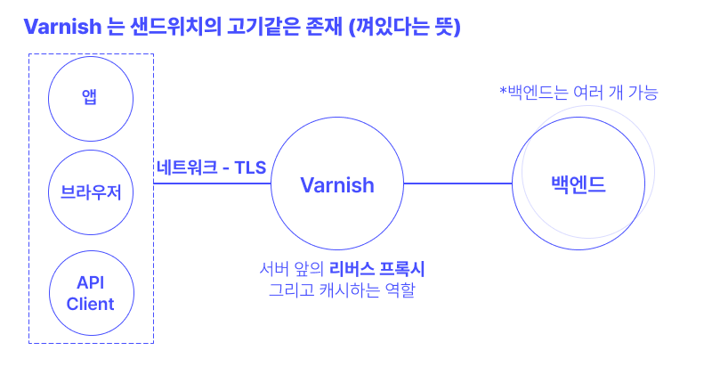
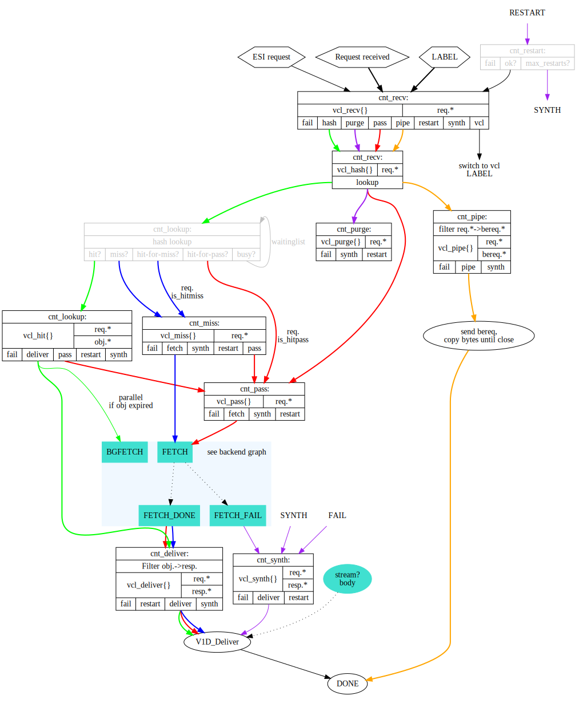

## 서론 

언제나 처럼 뭔데요 시리즈. 새로운 팀에서는 varnish 를 통해서 페이지를 캐싱해 성능 개선을 노리는 부분이 있다. 그러나 varnish 자체가 뭔지 모르는 나... 그냥 광내는 건 줄 알았다고. 그래서 오늘은 varnish 를 간략하게 살펴본다. 

### varnish...  너 뭐 돼? 

varnish를 구글에 검색해보면 가장 먼저 **varnish cache** 를 마주하게 된다. 그리고 유쾌한 설명이 눈에 띈다. [나 처음이니까.. varnish 암튼 알려'줘' 링크](https://varnish-cache.org/intro/index.html#intro) 를 들어가보면 이런 설명이 씌여있다. 

> Varnish 캐시는 웹 어플리케이션 가속기 (혹은, 캐싱 HTTP 리버스 프록시) 입니다.  HTTP 프로토콜로 통신하는  서버 앞에 설치하면 콘텐츠를 캐싱해줍니다. Varnish Cache는 겁나 빠릅니다. 구조에 따라 다르겠지만 대략 300-1000 배 까지 속도를 올려줍니다. 

그러니까 varnish 캐시는 우리에게 익숙한 nginx 가 대개 하는 것 처럼, 서버 앞에서 리버스 프록시로서 역할을 해주면서, 중간에 캐싱을 통해서 성능을 올리는 역할을 한다. 캐싱은 보통 HTTP 응답을 통짜로 캐싱하는 것이 될 것이고, 자신감의 원천은 무엇인지 모르겠지만 최대 1000배 까지도 성능을 올려준다고 한다. 리버스 프록시를 또 한번 복습하며 그들의 표현을 빌리면, [beef-in-sandwich](https://varnish-cache.org/docs/6.6/tutorial/introduction.html) 의 형태를 띄고 있는게 varnish 의 구조다. 



varnish 를 도입하자고 하면 대개 이 varnish cache를 말하는 모양이다. 그러므로 이 글에서도 계속 varnish cache 를 varnish 라고 대체해 부르도록 하겠다. 

그런데 곰곰히 생각해보니. 일부 페이지는 캐싱하고 싶지 않을 수도 있을 것이고, 리버스 프록시 낀 김에 거기에서 자잘한 일도 해주고 싶고... 그렇겠지? 그런 룰을 정하려고하는데 varnish 에서는 VCL (Varnish Configuration Language) 라는 것을 만들어서 정책을 정해달라고 한다. 이 VCL 을 가지고 들어오는 요청을 어떻게 처리할 지 정해주기도 하고, 응답을 어떻게 할 지 정해주기도 한다. 

그냥 지나가면 서운하니까 공식 developer portal의 예제를 들고 왔다. 

```vcl 
vcl 4.1;

backend default {
    .host = "backend.example.com";
    .port = "80";
}

backend image {
    .host = "image.example.com";
    .port = "80";
}

sub vcl_recv {
    if(req.url ~ "\.(png|jpg|svg)$") {
        set req.backend_hint = image;
    }    
}
```

위의 형태가 vcl를 사용한 varnish 의 룰을 정해주는 방식이다. varnish 가 요청을 받아서 결국에 최종적으로 향할 `backend` 를 정해준다. 이 backend 는 위 이미지에서도 언급했듯, 여러 개가 될 수 있다. 그리고 varnish 는 여러 state 를 거치는데, 각 state 에서 어떤 행위를 할 지 서브루틴(sub) 을 통해서 지정할 수 있다. 예를 들어 위에서 명시된 `vcl_recv` 는 요청을 받았을 때의 서브루틴인데, 만약 요청의 url 에 `png` 등이 포함되어있으면 backend 를 `image` 백엔드로 요청을 토스하라는 것으로 보인다. 

이 유한 상태 머신 (finite state machine) 의 내용을 알면 varnish의 어떤 서브루틴을 사용해야지 원하는 액션을 할지 알 수 있다. 아래는 [https://varnish-cache.org/docs/6.6/reference/states.html](https://varnish-cache.org/docs/6.6/reference/states.html) 에서 찾아 볼 수 있는 varnish 의 fsm 도표다. 당연히 완벽하게 이해할 필요는 없고 가져다 쓰는 입장에서 필요한 것만 취사선택 잘 하도록 하자! 


이렇게 짜여진 vcl 프로그램은 매니저 프로세스에 의해서 컴파일이 되고, 자식 프로세스에 의해서 실행된다. 이 과정은 매번 http request 가 들어올 때 마다 반복된다. 하지만 C라서 빠르다는 것도 그들의 첨언.. 


### 참고) bereq 넌 또 뭔데
기존에 설치된 varnish 코드를 이해하던 중 bereq 라는 예약어가 나타났고 찾아봤다. 
> `bereq.*` is the “backend request” as created from the original request. It may differ slightly - Varnish can convert HEAD requests to GET for example.

원 요청에서 생성된 `backend request`. 원래의 request 와는 좀 다른데, varnish 가 HEAD  request 를 GET 으로 변형해서 요청 해줄 수 있는 등, 변환이 이뤄질 수 있다. (이때 생성된게 backend request)

## 아 됐고 그래서 cache 는 했는데 여부를 알 수 가 없어 

나는 다 짜여진 varnish 프로그램을 건드리는 입장이었는데, cache hit 를 알 수가 없었다. varnish 역시 자체적으로 남기는 로그가 있긴하다. 한번 예시를 알아보도록하자. 
```bash 
*   << Request  >> 318737
-   Begin          req 318736 rxreq
-   Timestamp      Start: 1612787907.221931 0.000000 0.000000
-   Timestamp      Req: 1612787907.221931 0.000000 0.000000
-   VCL_use        boot
-   ReqStart       192.0.2.24 39698 a1
-   ReqMethod      GET
-   ReqURL         /vmods/
-   ReqProtocol    HTTP/1.1
-   ReqHeader      Host: varnish-cache.org
-   ReqHeader      Accept: text/html, application/rss+xml, […]
-   ReqHeader      Accept-Encoding: gzip,deflate
-   ReqHeader      Connection: close
-   ReqHeader      User-Agent: Mozilla/5.0 […]
-   ReqHeader      X-Forwarded-For: 192.0.2.24
-   VCL_call       RECV
-   VCL_acl        NO_MATCH bad_guys
-   VCL_return     hash
[…]
```

그만 알아보자. 🥲
varnish 는 말 그대로 모든 로그를 남기는 것이 기본 정책이기때문에, 파일로 떨구는 것이 default 가 아니다. 만약 파일로 떨구기 시작하면 어마어마하게 큰 크기를 차지하며 당신의 varnish 서버 디스크를 잡아먹고 말 것이다.... 그러므로, 만약 cache hit 을 varnish log 를 통해서 알고 싶다면 간단한 grep 사용이 필요하다. 


기본적으로 varnishlog는 varnish 가 설치되어있는 bin(바이너리) 폴더에 함께 있고, `./varnishlog` 로 실행할 수 있게 되어있다(리눅스 기준). 나는 아래의 링크를 참조하여 필요한 옵션을 주었다.
https://varnish-cache.org/docs/6.6/users-guide/operation-logging.html?highlight=log

```bash
./varnishlog -b -g request | grep -e 'timestamp' -e 'BereqURL' -e 'BereqMethod'
```
varnish는 샌드위치 사이의 고기같은 것이므로 ㅋㅋㅋ client 사이드와의 통신, 그리고 backend 서버와의 통신이 모두 로깅된다. (겁나 정신없음 주의) `-b` 옵션을 통해서는 backend 서버 쪽의 통신을 보여준다. 캐시 hit를 테스트 방법은 좀더 무식한데, 최초 request 할 때 backend 쪽에 날아간 요청의 수 > cache 이후의 요청의 수 이면 나는 캐시 hit 라고 생각했다. 크로스 체크를 위해서는 backend 쪽의 로그를 살펴봐도 좋지만, 이걸로 충분하다고 생각한다. 

## 마무리하며 
varnish cache 는 특이하게도 캐싱에 초점을 맞춘 리버스 프록시 서버다. C로 되어 빠르다고 하고, 버전이 7버전 까지 나오며 유지보수 되는 등 나름의 인정을 받고 있는 어플리케이션이라고 생각된다. 다만 오랜시간 유지보수 되어 문서가 많고 (파편화) 되어있으니 버전을 잘 맞춰 문서를 보는 것이 중요하다. 또한 단순 캐싱 서버를 넣었기때문에 성능 향상이 있겠지~ 하고 마무리하는 것이 아니라 실제 hit 비율이 얼마나 되는지, 전후의 성능향상이 어느 정도인지 측정하는 자세가 필요하다. 😎 아무튼 이 정도로 마무리! 

``
## 참고 

- https://varnish-cache.org/docs/
- https://www.varnish-software.com/developers/tutorials/redirect/
- https://www.varnish-software.com/developers/quick-start/
- https://varnish-cache.org/docs/6.6/users-guide/
- https://jonnung.dev/system/2020/03/18/increasing-varnish-cache-hit-rate/